# CycleVAD — IPAD R01–R04 experiments

공정의 연속 진행 위치를 추적해 조건부 외형 이상과 진행 흐름의 이상을 결합하는 subspace AD 실험입니다.

로컬 **NVIDIA RTX PRO 6000 Blackwell Max-Q 96GB**에서 특징을 추출하고 CPU에서 통계 모델을 학습합니다. 수치는 실제 결과 JSON에서 자동 생성합니다.

## 초기 실험 E0–E5 관찰

- Seed 42, stride 2의 Full Macro AUROC는 **78.31%**, Appearance는 **76.05%**입니다.
- 진행 점수의 추가 효과(A2−A0)는 Macro AUROC **+2.269 pp**입니다. 조건부 외형의 추가 효과는 현재 설정에서 거의 없습니다.
- Confidence 가중치를 제거하면 Full 대비 Macro AUROC가 **+1.082 pp** 변합니다. 이는 신뢰도 가중 방식의 재검토 근거이며, 테스트 결과로 최적 모델을 확정한 것은 아닙니다.
- R01 Full의 정상 프레임 오경보율은 **64.25%**입니다. 정상 holdout q99 임계값이 테스트 정상 프레임에 잘 일반화되지 않아, 높은 Recall을 단독으로 해석하면 안 됩니다.
- R02에서 나타난 큰 향상이 R01·R04에서는 재현되지 않습니다. 장면별 결과와 음의 효과도 함께 공개합니다.

## 후속 실험 E6–E10

[사전 고정 실험 명세](docs/FOLLOWUP_EXPERIMENTS.md) · [후속 검사 로그](results/followup_tests.txt)

### E6 — 정상 분할·보정 이동 진단 완료

정상 111개 영상의 5개 분할(장면×fold 20개)에서 fit/validation/reference/threshold/evaluation 중복이 없고 각 영상이 정확히 한 번 평가됨을 확인했습니다. 파일 간 원본 recording 독립성은 아직 미확인입니다. 40개 영상의 모델 예측을 숨긴 로컬 프레임 뷰어와 접촉시트를 준비했습니다. **실제 cycle 주석은 0개이며 위치 정확도는 미측정**입니다.

| 장면 | Reference FPR % | Threshold FPR % | Normal eval FPR % | Historical normal FPR % | Eval 영상 평균 FPR % |
| --- | --- | --- | --- | --- | --- |
| R01 | 0.00 | 0.89 | 0.00 | 47.92 | 0.00 |
| R02 | 1.51 | 0.76 | 0.97 | 1.18 | 0.96 |
| R03 | 2.07 | 0.94 | 7.12 | 4.28 | 7.29 |
| R04 | 0.00 | 0.90 | 1.54 | 4.08 | 1.55 |

표는 fold 0의 C-00 Full, 각 분할의 정상 프레임 기준입니다. Reference/threshold는 보정에 사용했으므로 일반화 성능이 아닙니다. Historical은 기존 테스트의 정상 라벨 구간입니다. 정상 q99라도 새로운 정상 영상에서 1% FPR을 보장하지 않습니다. 테스트 정상 구간에는 앞선 이상으로 인한 추적 상태 영향도 있을 수 있어, 이 차이를 촬영 환경 변화만의 원인으로 확정하지 않습니다.

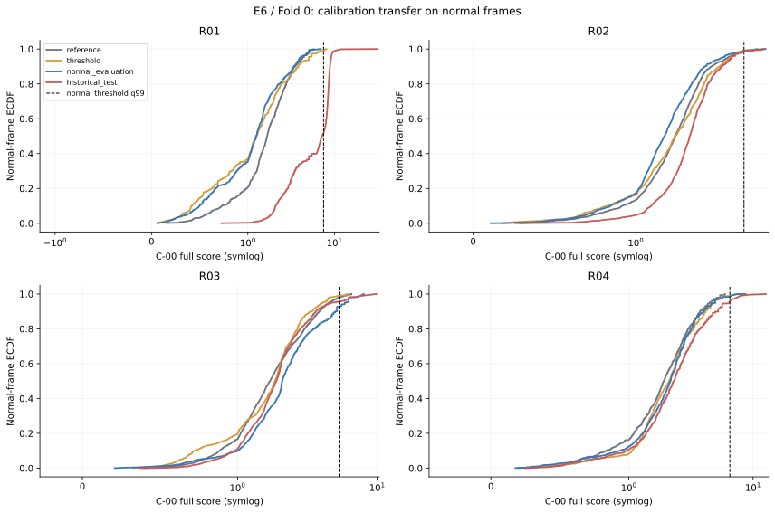

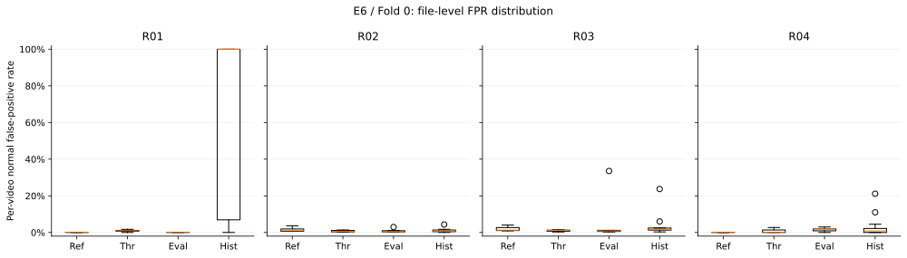

R01 historical 정상 오경보 1165프레임 중 **98.45%**에서 pooled 외형 분기가 최댓값이었습니다. Confidence로 가중한 조건부 분기가 최댓값인 오경보는 0개였습니다. 이는 점수 귀속 진단이며 촬영 환경 등 원인을 확정하는 인과 분석은 아닙니다. [분기별 진단](results/E6/R01_channel_diagnosis.json)

[E6 수치](results/E6/calibration_summary.json) · [분할 검사](results/E6/fold_audit.json) · [주석 자료 상태](results/E6/annotation_packet.json)

### E8 — Confidence 3×3 실험 seed 42 완료

20개 장면×fold, 통계 모델 60개를 학습하고 각 모델의 추론 게이트 3종과 readout 3종을 평가했습니다. 각 fold의 추적기·θ·pooled/local 분기와 C-00에서 선택한 Fourier 차수·ridge를 고정했습니다. C-00 재학습 및 원래 점수와의 동등성 검사를 모두 통과했습니다.

C-행열: 학습 행 0=legacy, 1=위치 신뢰도 r, 2=균등; 추론 열 0=legacy, 1=r, 2=gate 없음. 아래 주지표는 max(appearance, conditional)입니다. 모든 조합과 readout은 각각 정상 q99 임계값을 사용합니다.

| 조합 | Historical macro AUROC % | Historical macro AP % | R01 정상 OOF FPR % | R02 정상 OOF FPR % | R03 정상 OOF FPR % | R04 정상 OOF FPR % |
| --- | --- | --- | --- | --- | --- | --- |
| C-00 | 76.26 | 68.01 | 5.49 | 1.14 | 4.84 | 1.77 |
| C-01 | 76.23 | 68.05 | 5.49 | 1.19 | 3.81 | 1.77 |
| C-02 | 77.51 | 70.50 | 5.48 | 1.19 | 3.97 | 2.12 |
| C-10 | 76.25 | 68.01 | 5.49 | 1.14 | 4.84 | 1.77 |
| C-11 | 76.22 | 68.05 | 5.49 | 1.21 | 3.81 | 1.77 |
| C-12 | 77.59 | 70.66 | 5.65 | 1.18 | 3.99 | 2.24 |
| C-20 | 76.25 | 68.01 | 5.49 | 1.14 | 4.84 | 1.77 |
| C-21 | 76.23 | 68.05 | 5.49 | 1.21 | 4.11 | 1.77 |
| C-22 | 77.82 | 71.10 | 5.40 | 1.18 | 4.08 | 2.22 |

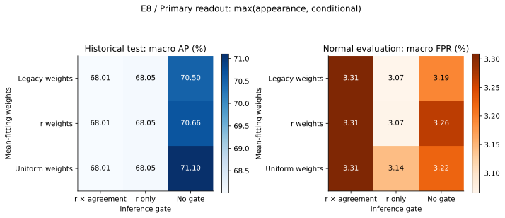

사전에 고정한 C-21의 C-00 대비 historical macro AP 변화는 **+0.039 pp**입니다. AP +1 pp 및 장면별 정상 FPR 증가 ≤1 pp라는 점추정 기준은 **미충족**입니다. 기존 테스트는 탐색적 진단이며 확증 자료가 아닙니다.

[전체 요약](results/E8/summary.json) · 각 장면/fold의 metrics.json, per_video.json, mechanism.json에는 27개 readout과 gate 활성 비율·점수 분포가 포함됩니다. seed 43/44 재검증 결과는 아래에 정리했습니다.

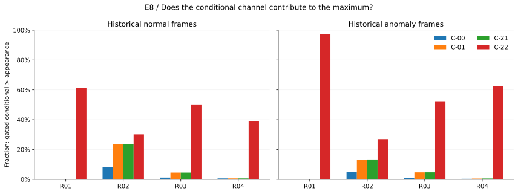

R01은 일치도 항을 제거해도 r 자체가 낮고 조건부 점수가 외형 점수를 넘는 비율이 0%였습니다(C-00/C-01/C-21, historical 이상 프레임). 낮은 r이 실제 위치 오차인지 반복 외형의 모호성인지 구분하려면 E7 주석이 필요합니다.

| Readout | 조합 | Historical macro AUROC % | Historical macro AP % |
| --- | --- | --- | --- |
| conditional_only | C-00 | 69.12 | 57.43 |
| conditional_only | C-21 | 73.31 | 64.31 |
| conditional_only | C-22 | 79.40 | 72.43 |
| appearance_conditional | C-00 | 76.26 | 68.01 |
| appearance_conditional | C-21 | 76.23 | 68.05 |
| appearance_conditional | C-22 | 77.82 | 71.10 |
| full | C-00 | 78.46 | 70.55 |
| full | C-21 | 78.43 | 70.55 |
| full | C-22 | 79.60 | 73.16 |

사전 대조군 C-22(균등 학습·gate 없음)의 주 readout AP 변화는 **+3.090 pp**, 파일 bootstrap 95% 구간은 [+1.784, +4.916] pp입니다. C-21을 사후 교체하지 않았으며, gate 제거를 별도 가설로 검토할 근거입니다. 두 구간은 다중 비교 보정 없는 탐색적 구간입니다.

C-21−C-00 historical macro AP의 파일 단위 paired bootstrap 95% 구간: **[-0.161, +0.300] pp** (2,000회). 영상 원본 그룹 독립성은 미검증입니다. [불확실성 수치](results/E8/paired_bootstrap.json)

### E8 — seed 43·44 고정 설정 재검증 완료

총 3 seeds × 4 scenes × 5 folds에서 통계 모델 180개, 조합별 readout 1,620개를 평가했습니다. Seed 42의 각 fold에서 선택한 Fourier 차수·ridge, 데이터 분할과 특징 투영을 고정했습니다. 표는 주 readout의 historical macro AP입니다.

| Seed | C-00 AP % | C-21 AP % | C-22 AP % | C-21 ΔAP pp | C-22 ΔAP pp |
| --- | --- | --- | --- | --- | --- |
| 42 | 68.01 | 68.05 | 71.10 | +0.039 | +3.090 |
| 43 | 68.55 | 68.63 | 71.77 | +0.083 | +3.225 |
| 44 | 68.62 | 68.58 | 71.45 | -0.044 | +2.829 |

같은 자료에서의 seed 민감도이며 독립 데이터 재현을 의미하지 않습니다. [재검증 수치](results/E8/robustness.json)

재실행: `PYTHONPATH=src python scripts/run_followup.py --data-root /path/to/IPAD_dataset` 후 `--seed 43`, `--seed 44`로 반복합니다. `scripts/prepare_annotation_packet.py`는 로컬 원본 경로에서 주석 뷰어를 생성합니다. `scripts/bootstrap_followup.py`와 `--candidate C-22`로 paired CI를 계산하고, `scripts/check_followup.py`로 저장된 점수와 수치를 검증합니다. [정합성 검사](results/followup_validation.txt)

E7: T0/T1/T2 인과적 예측을 로컬에 저장했으며 [독립적인 실제 cycle/anchor 주석](docs/ANNOTATION_GUIDE.md)이 필요합니다. E9S: 합성 편집 검증은 E7 주석과 독립적으로 진행하며 아래 실행 결과를 따릅니다. 실제 유형별 E9R은 주석이 필요합니다. E10: 신규 독립 촬영 자료가 필요합니다. 미실행 항목을 완료로 표시하지 않습니다.

### 다음 실험 계획

[위치별 정상 기준과 진행 이상 검증 계획](docs/PHASE_PROCESS_EXPERIMENTS.md)을 고정했습니다. E8B는 위치 조건 5개 비교군, E9S는 진행 점수 10개 비교군을 사용합니다. 편집 후보 3,996개 중 3,910개가 길이 검사를 통과했습니다. 실행 결과는 아래 E8B / E9S 절에 정리했습니다.

## 위치·진행 검증 E8B / E9S

[고정 실험 명세](docs/PHASE_PROCESS_EXPERIMENTS.md) · [35개 코드 검사](results/phase_process_tests.txt)

### E8B — 위치별 정상 기준 검증 완료

60개 장면×fold×seed, 640개 비교 모델을 평가했습니다. Confidence 가중치와 추론 게이트를 제거하고 진행 점수를 제외했습니다. M0=θ 없는 pooled PCA, M1=첫 관측 위치+정상 FIT 시간, M2=관측별 위치, M3=누적 추적 위치(C-22), M4=영상별 고정 무작위 위치 이동입니다. M4의 다섯 offset은 별도 학습·보정한 대조군이며 독립 영상으로 세지 않았습니다.

| 조건 | Historical AP % | AUROC % | R01 정상 FPR % | R02 정상 FPR % | R03 정상 FPR % | R04 정상 FPR % |
| --- | --- | --- | --- | --- | --- | --- |
| M0 | 67.99 | 76.26 | 5.49 | 1.14 | 4.84 | 1.77 |
| M1 | 65.51 | 75.06 | 5.75 | 3.39 | 3.38 | 2.36 |
| M2 | 68.77 | 76.53 | 5.38 | 1.14 | 4.89 | 1.23 |
| M3 | 71.10 | 77.82 | 5.40 | 1.18 | 4.08 | 2.22 |
| M4_1101 | 67.76 | 76.00 | 5.30 | 1.04 | 4.80 | 1.44 |
| M4_1102 | 68.13 | 76.34 | 5.38 | 1.03 | 4.67 | 2.03 |
| M4_1103 | 67.82 | 76.04 | 5.39 | 1.12 | 4.89 | 1.77 |
| M4_1104 | 67.76 | 76.03 | 5.49 | 1.18 | 3.95 | 1.91 |
| M4_1105 | 68.09 | 76.31 | 5.05 | 1.08 | 4.85 | 1.85 |

표는 seed 42, 외형+조건부 점수입니다. Historical은 fold 0의 기존 테스트, 정상 FPR은 5-fold OOF 전체 정상 프레임 기준입니다. 라벨 길이 불일치 R02 테스트 12/13/14는 전체 제외했습니다. M0의 결합 점수는 외형 점수와 정확히 같습니다. M3의 균등 μ 재학습 동등성을 확인했습니다.

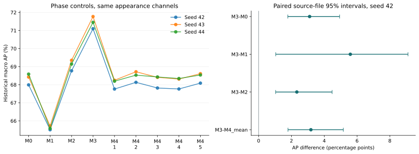

| 사전 지정 비교 | Macro AP 차이 pp [95% CI] |
| --- | --- |
| M3-M0 | +3.11 [+1.78, +4.94] |
| M3-M1 | +5.59 [+1.04, +9.11] |
| M3-M2 | +2.33 [+1.03, +4.48] |
| M3-M4_mean | +3.19 [+1.79, +5.16] |

신뢰구간은 seed 42 모델을 고정한 장면별 원본 영상 단위 paired bootstrap 2,000회입니다. 파일 간 원 촬영의 독립성은 미확인이고 다중 비교 보정은 하지 않았습니다. 현재 관측을 이용한 μ의 정상 재구성 오차는 위치 GT 정확도나 미래 예측 정확도가 아닙니다.

| Seed | M0 AP % | M3 AP % | M3−M0 pp | M3−M4 평균 pp |
| --- | --- | --- | --- | --- |
| 42 | 67.99 | 71.10 | +3.11 | +3.19 |
| 43 | 68.43 | 71.77 | +3.35 | +3.31 |
| 44 | 68.59 | 71.45 | +2.87 | +3.05 |

사전 점추정 기준(AP +1 pp, 각 장면 정상 FPR 증가 ≤1 pp)은 **충족**입니다. 최대 장면 FPR 증가는 +0.45 pp입니다. M3−M0 및 M3−M4 CI의 0 포함 여부는 각각 **미포함 / 미포함**입니다. 이 결과는 위치 조건의 추가 가치를 탐색적으로 뒷받침하지만, 기존 테스트를 사용했으므로 독립 확증 결과는 아닙니다.

| 민감도 조건 (seed 42) | 외형+조건부 AP % | 조건부 단독 AP % |
| --- | --- | --- |
| M0_fixedrank | 67.84 | 68.05 |
| M3_fixedrank | 71.10 | 72.43 |
| M1_retuned | 65.45 | 67.33 |
| M2_retuned | 68.94 | 70.11 |
| M3_retuned | 71.10 | 72.43 |

고정 rank에서는 두 모델의 축 수를 동일하게 맞췄고, retuned에서는 각 조건에 동일한 정상 validation 9개 조합 탐색을 적용했습니다. 주 비교와 분리하여 보고합니다. 개별 장면의 μ MSE, subspace 외부 MSE, 유지 rank, 영상 평균 FPR과 historical recall·활성화는 아래 JSON에 공개했습니다.

[E8B 요약](results/E8B/summary.json) · [paired CI](results/E8B/paired_bootstrap.json) · [점수 재검증](results/E8B/validation.txt) · [분할별 원자료](results/E8B/)

### E9S — 합성 진행 이상 검증 완료

정상 OOF 영상 111개에 정지·역행·생략·인접 구간 교환을 적용했습니다. 길이 조건을 통과한 3,910개 편집을 seed 42/43/44, stride 2에서 반복하고 seed 42는 stride 1에서도 확인했습니다(총 15,640개 편집 평가, 80개 모델 분할). 제외한 86개 후보도 사전 목록에 남겼습니다. 실제 산업 고장 유형이나 위치 GT 검증을 의미하지 않습니다.

원본 프레임 순서를 편집한 뒤 출력 시간을 샘플링하고 추적 상태·차분·AR 예측을 처음부터 다시 계산했습니다. 모델은 원본 인덱스와 편집 위치를 입력받지 않습니다. 인과적 descriptor lag=4, 차분/진행 lag=2·8·32 원본 프레임으로 두 stride를 맞췄습니다. FIT 영상 길이 중앙값 T는 실제 cycle 주석이 아닌 약한 시간 기준입니다.

| 모델 | Window AUROC % | AP % | Event hit % | Matched normal FAR % | Grid normal FAR % |
| --- | --- | --- | --- | --- | --- |
| P0 Appearance | 48.22 | 51.36 | 7.88 | 6.86 | 7.86 |
| P1 + alignment | 52.37 | 55.70 | 12.41 | 6.78 | 7.61 |
| P2 + innovation | 73.43 | 73.73 | 41.16 | 7.62 | 8.14 |
| P3 + progress | 74.41 | 75.49 | 44.47 | 9.86 | 9.41 |
| P4 + all process | 78.66 | 79.44 | 50.24 | 9.78 | 8.88 |
| P5 + AR(1) | 64.79 | 66.53 | 31.66 | 9.58 | 8.81 |
| P6 + difference 2 | 64.83 | 63.89 | 18.40 | 7.72 | 8.53 |
| P7 + difference 2/8/32 | 66.13 | 65.15 | 19.17 | 8.76 | 9.16 |
| P8 + innovation/progress | 78.29 | 79.11 | 51.98 | 9.86 | 9.41 |
| P9 + observation-only process | 76.01 | 77.80 | 49.82 | 6.73 | 8.08 |

주 운영점은 별도 정상 threshold 영상의 0.2T window maximum q99입니다. Event는 편집 후 0.2T 이내 탐지, AUROC/AP는 동일 길이 0.4T 원본/편집 window maximum 비교입니다. AP의 가중 양성 비율은 50%입니다. 정상 matched FAR은 편집 위치와 같은 원본 창, grid FAR은 정상 영상 전체의 고정 창입니다. q99는 평가 정상 영상에서 1% FAR을 보장하지 않습니다.

각 scene/fold/type/severity 안에서 원본 영상마다 같은 총 가중치를 주고, fold AUROC/AP를 적격 영상 수로 평균한 뒤 severity/type/scene을 동일 비중으로 평균했습니다. 서로 다른 fold의 점수를 합쳐 AUROC를 계산하지 않았습니다.

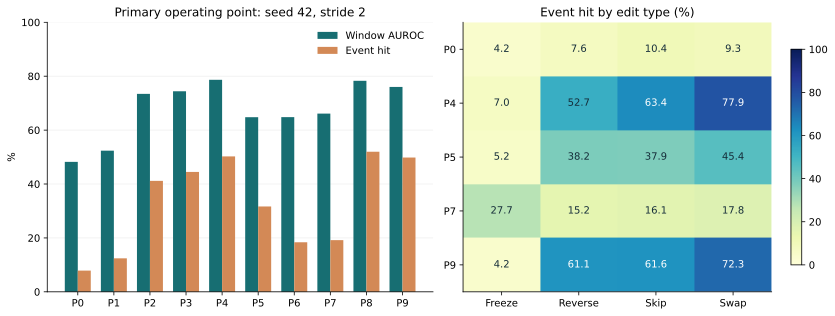

| 편집 유형 | P4 event % | P5 event % | P7 event % | P9 event % |
| --- | --- | --- | --- | --- |
| freeze | 6.99 | 5.23 | 27.65 | 4.23 |
| reverse | 52.69 | 38.21 | 15.18 | 61.10 |
| skip | 63.41 | 37.86 | 16.11 | 61.60 |
| swap_adjacent_blocks | 77.88 | 45.35 | 17.76 | 72.33 |

**정지는 뚜렷한 예외입니다.** P4의 정지 탐지율은 6.99%로, 양방향 다중 차분 P7의 27.65%보다 낮습니다. 평균 향상은 주로 역행·생략·구간 교환에서 나왔으며, 세 가지 진행 이상을 모두 잘 잡는다고 주장하면 안 됩니다.

| 비교 | Event 차이 pp [95% CI] |
| --- | --- |
| P4-P0 | +42.37 [+38.89, +45.82] |
| P4-P5 | +18.58 [+14.43, +22.61] |
| P4-P7 | +31.07 [+26.60, +35.64] |
| P8-P1 | +39.56 [+35.82, +43.52] |
| P4-P9 | +0.43 [-2.94, +3.59] |

원본 영상으로 묶은 paired bootstrap 2,000회이며 모델은 고정했습니다. 모든 편집·원본 창은 같은 cluster에 남깁니다. 전체 AUROC/AP·정상 FAR 구간도 JSON으로 공개합니다.

| 장면 | P4 event % | P4−P7 event pp | P4 matched FAR % | P4 grid FAR % |
| --- | --- | --- | --- | --- |
| R01 | 43.46 | +32.56 | 12.66 | 10.50 |
| R02 | 60.60 | +41.48 | 6.39 | 5.89 |
| R03 | 54.10 | +16.10 | 16.41 | 12.91 |
| R04 | 42.81 | +34.14 | 3.67 | 6.22 |

**진행 이상 탐지의 추가 가치는 관찰되지만, 사전 오경보 기준은 미충족입니다.** P4의 정상 matched/grid FAR이 여러 장면에서 5%를 넘습니다. P4−P9 이벤트 차이의 CI는 0을 포함하므로, 누적 위치 추적이 관측 기반 진행 점수보다 운영점 탐지율을 높였다고 확정할 수 없습니다. P1도 시간 차분 descriptor를 쓰므로 순수 정적 외형 비교군이 아닙니다. 이 결과로 주장할 수 있는 범위는 “위치·진행 일관성 점수의 합성 시간 교란 탐지 효과”이며, 실제 정상 오경보 보정과 실제 공정 주석 검증이 남아 있습니다.

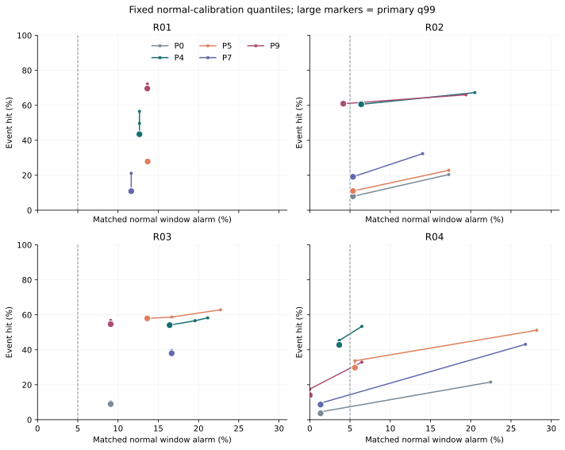

주 q99는 큰 점으로 표시했습니다. 곡선은 사전 고정 q90/q95/q97.5/q99/q99.5의 별도 보정 결과이며 평가 데이터를 보고 임계값을 선택하지 않았습니다. 두 축은 장면별 macro matched FAR/event입니다.

| Stride / seed | P4 AUROC % | P4 event % | P4−P5 event pp | P4−P7 event pp | P4−P9 event pp |
| --- | --- | --- | --- | --- | --- |
| 2 / 42 | 78.66 | 50.24 | +18.58 | +31.07 | +0.43 |
| 2 / 43 | 77.81 | 50.08 | +20.19 | +31.91 | +1.90 |
| 2 / 44 | 78.11 | 49.03 | +16.02 | +26.55 | -1.64 |
| 1 / 42 | 74.86 | 51.28 | +19.38 | +33.32 | +2.02 |

Stride 비교는 원본 시간 lag와 transition 분산·restart hazard를 맞춘 민감도 실험입니다. 관측 밀도와 정상 학습 통계는 여전히 달라집니다. seed 반복은 독립 데이터 반복이 아닙니다.

| Speed stress (seed 42, stride 2) | P0 grid alarm % | P4 grid alarm % | P7 grid alarm % | P9 grid alarm % |
| --- | --- | --- | --- | --- |
| 0.8 | 7.78 | 9.08 | 10.26 | 7.62 |
| 1.0 | 7.86 | 8.88 | 9.16 | 8.08 |
| 1.2 | 7.78 | 11.12 | 10.45 | 9.96 |

속도 변형은 실제 정상 허용 범위가 확인되지 않은 stress test입니다. 실행 중 Identity replay 최대 오차는 모든 분할에서 0이었습니다. 저장 모델을 다시 읽어 320개 편집을 재계산했을 때 최대 점수 차이는 9.93×10⁻⁶이었고, 검사한 탐지 시점은 모두 같았습니다. 최초 32프레임 경계 반응과 편집 내부 반응을 분리하여 저장했습니다. skip에는 지속되는 내부 구간 GT를 만들지 않았으며, 내부 구간이 없는 짧은 편집은 해당 지표에서 제외했습니다. 탐지 지연은 탐지된 사례에 조건부이므로 miss 비율(1−event)과 함께 해석해야 합니다. 유형·강도별 지연과 내부 구간 coverage는 각 요약에 있습니다.

| 보조 frame-q99 운영점 | P0 | P4 | P5 | P7 | P9 |
| --- | --- | --- | --- | --- | --- |
| Event hit % | 18.45 | 60.35 | 46.04 | 44.56 | 61.28 |
| Matched normal FAR % | 17.00 | 18.02 | 24.17 | 24.40 | 15.59 |

보조 frame-q99는 주 window-q99와 별도이며 서로 같은 오경보 예산으로 해석하지 않습니다.

[Seed 42 상세](results/E9S/stride2/seed42/summary.json) · [Seed 43](results/E9S/stride2/seed43/summary.json) · [Seed 44](results/E9S/stride2/seed44/summary.json) · [Stride 1](results/E9S/stride1/seed42/summary.json) · [paired CI](results/E9S/stride2/seed42/paired_bootstrap.json) · [아티팩트 재검증](results/E9S/validation.txt)

재실행: `PYTHONPATH=src python scripts/run_phase_process.py --stage E8B --resume`, `--stage E9S --resume`, `--stage E9S --stride 1 --seeds 42 --resume`. 이어 `scripts/summarize_phase_process.py --stage E8B` 및 E9S의 각 `--seed`/`--stride`를 실행합니다. 주 E9S는 `--bootstrap`을 붙입니다. `scripts/check_phase_process.py --stage E8B`/`E9S`로 검증하고 `scripts/report_phase_process.py --include-e9`로 문서를 재생성합니다. 특징 추출은 로컬 RTX PRO 6000의 고정 캐시를 재사용했고 새 통계 모델은 CPU에서 학습했습니다.

## 논문 통합 실험 E11·E12·E14

[고정 실행 규칙](docs/PAPER_STAGE1_PROTOCOL.md) · [실행 설정](configs/experiments/followup/paper_stage1_v1.json) · [코드 검사](results/paper_stage1_tests.txt)

### E11 — 동일 파이프라인 통합 ablation 완료

60개 scene×fold×seed에서 같은 PhysicalTracker·외형 모델을 공유하고, 새 조건부 평균·잔차 PCA와 모든 점수의 정상 reference 보정을 구성했습니다. C는 균등 학습·gate 없음, P는 alignment·innovation·progress입니다. E8B와 E9S의 저장 점수를 사후 합친 결과가 아닙니다.

| 모델 | Historical AP % | AUROC % | 합성 event % | Matched 정상 FAR % | Grid 정상 FAR % |
| --- | --- | --- | --- | --- | --- |
| B0 A | 68.00 | 76.26 | 7.88 | 6.86 | 7.86 |
| B1 A+C | 71.10 | 77.81 | 25.85 | 7.53 | 9.26 |
| B2 A+P | 70.56 | 78.47 | 50.24 | 9.78 | 8.88 |
| B3 A+C+P | 73.11 | 79.59 | 51.61 | 9.78 | 9.56 |
| C C only | 72.42 | 79.40 | 33.78 | 7.75 | 9.65 |
| P P only | 62.43 | 69.48 | 57.43 | 10.88 | 7.26 |

주 운영점은 모델별 정상 window-q99이며 목표 보정 규칙이 같아도 평가 FAR은 같지 않습니다. Historical은 이전 개발에 사용한 테스트 fold 0이고 이상 유형은 미주석입니다. 합성은 정상 OOF 111개 원본의 고정 3,910개 편집/seed입니다. 주 event deadline은 합성 0.2T, historical min(이벤트 길이,0.2T)입니다. AUROC/AP는 historical 프레임 단위, 합성 점수 순위는 별도 JSON에 window 단위로 공개합니다.

| 주 비교 | Historical AP 차이 pp [95% CI] | 합성 event 차이 pp [95% CI] |
| --- | --- | --- |
| B3−B2 | +2.55 [+1.37, +4.15] | +1.36 [+0.69, +2.15] |
| B3−B1 | +2.01 [-0.66, +5.25] | +25.76 [+22.92, +28.60] |

CI는 seed 42의 고정 모델에 대해 장면별 원본 영상 paired bootstrap 2,000회로 계산했습니다. C를 A+P에 추가한 AP 개선 구간은 양수지만, P를 A+C에 추가한 AP 개선 구간은 0을 포함합니다. 합성에서는 P 추가 효과가 크고 C 추가 효과가 작습니다. 높은 평균 성능만으로 상보성이나 동일 실제 오경보 조건의 우위를 확정하지 않습니다.

| Seed | B1 AP % | B2 AP % | B3 AP % | B3 합성 event % | B3 matched FAR % |
| --- | --- | --- | --- | --- | --- |
| 42 | 71.10 | 70.56 | 73.11 | 51.61 | 9.78 |
| 43 | 71.78 | 70.83 | 73.54 | 51.31 | 10.31 |
| 44 | 71.46 | 70.69 | 73.24 | 50.07 | 8.33 |

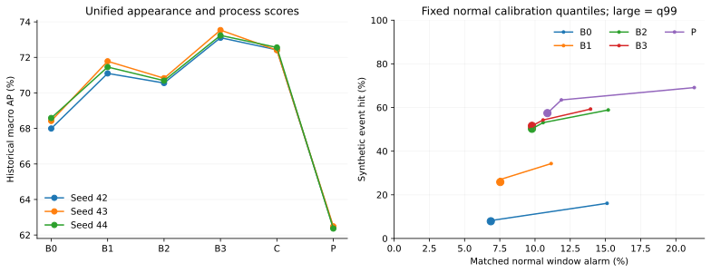

| 장면 | 이벤트 수 | B1만 | P만 | 둘 다 | 둘 다 실패 | Full 탐지 | B1 대비 추가/손실 | B2 대비 추가/손실 | 합집합 대비 Full 손실 |
| --- | --- | --- | --- | --- | --- | --- | --- | --- | --- |
| R01 | 8 | 7 | 0 | 1 | 0 | 8 | 0/0 | 0/0 | 0 |
| R02 | 15 | 0 | 1 | 4 | 10 | 5 | 1/0 | 0/0 | 0 |
| R03 | 17 | 0 | 1 | 3 | 13 | 4 | 1/0 | 0/0 | 0 |
| R04 | 26 | 6 | 1 | 8 | 11 | 12 | 1/3 | 0/0 | 3 |

표는 historical 이벤트의 실제 경보 결과입니다. B1과 P는 각자의 정상 임계값을 사용합니다. 결합 임계값을 다시 보정하므로 점수의 max 관계가 탐지 집합의 포함 관계를 보장하지 않습니다. 실제 유형별 상보성은 독립 주석 후 확인해야 합니다.

조건부 점수 계산은 float64로 수행했습니다. float32 행렬 연산의 batch 길이에 따른 반올림이 경험적 보정 점수에 증폭되는 것을 발견하여 모든 E11 분할을 다시 실행했고, 편집 이전 점수·추적 상태 불변성을 검사했습니다. [아티팩트 검증](results/E11/validation.txt) · [Historical 수치](results/E11/seed42/historical_summary.json) · [합성 수치](results/E11/seed42/synthetic_summary.json) · [Historical CI](results/E11/seed42/historical_bootstrap.json) · [합성 CI](results/E11/seed42/synthetic_bootstrap.json)

### E12 — 평균 함수와 공유 subspace 분리 비교 완료

60개 scene×fold×seed에서 9개 구조×3개 FIT 비율을 평가했습니다. S1은 연속 평균+공유 PCA이며, S3은 같은 연속 평균에 phase별 PCA를 적용해 공유 여부만 바꿉니다. 모든 PCA 조건은 해당 분할·부분집합의 동일한 총 rank를 사용하고 variance 조기 절단을 하지 않았습니다. 아래는 seed 42, FIT 100%입니다.

| 구조 | Head AP % | A+Head AP % | Head AUROC % | 모델 배열 KiB | 보정 포함 KiB | 완료 분할 |
| --- | --- | --- | --- | --- | --- | --- |
| S0 global mean/shared | 68.08 | 67.88 | 76.74 | 792.2 | 805.0 | 20/20 |
| S1 continuous/shared | 72.45 | 71.07 | 79.37 | 984.2 | 997.0 | 20/20 |
| S2_K4 4-bin mean/shared | 68.92 | 68.36 | 77.28 | 828.2 | 841.0 | 20/20 |
| S2_K8 8-bin mean/shared | 69.09 | 68.15 | 76.94 | 876.2 | 889.0 | 20/20 |
| S3_K4 continuous/4 PCA | 68.88 | 68.56 | 76.51 | 1020.2 | 1033.0 | 20/20 |
| S3_K8 continuous/8 PCA | 64.10 | 67.80 | 73.35 | 1068.2 | 1081.0 | 20/20 |
| S4_K4 4-bin mean/4 PCA | 64.76 | 67.64 | 74.59 | 864.2 | 877.0 | 20/20 |
| S4_K8 8-bin mean/8 PCA | 64.20 | 67.90 | 72.75 | 960.2 | 973.0 | 20/20 |
| S5 continuous/norm only | 62.00 | 67.95 | 72.98 | 204.0 | 210.4 | 20/20 |

AP/AUROC는 historical fold 0의 장면 평균입니다. 저장량은 20개 scene/fold 평균이며 추적기·공통 A·encoder는 제외합니다. 같은 총 rank라도 phase별 평균·고유값 및 μ 계수의 저장량이 달라 **동일 bytes 비교가 아닙니다**. 실제 저장량–성능 관계를 보고합니다.

| 비교 | Head AP 차이 pp [95% CI] |
| --- | --- |
| S1-S0 | +4.37 [+2.78, +6.42] |
| S1-S2_K4 | +3.53 [+2.25, +5.24] |
| S1-S2_K8 | +3.37 [+2.06, +5.19] |
| S1-S3_K4 | +3.58 [+1.42, +6.07] |
| S1-S3_K8 | +8.35 [+5.34, +11.94] |
| S1-S5 | +10.45 [+6.73, +14.46] |

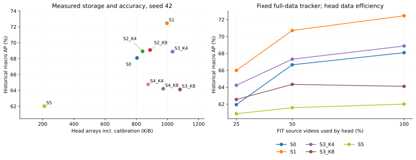

| FIT 비율 | S0 AP % | S1 AP % | S3_K4 AP % | S3_K8 AP % | S5 AP % |
| --- | --- | --- | --- | --- | --- |
| 25% | 61.94 | 65.99 | 64.23 | 62.55 | 60.86 |
| 50% | 66.66 | 70.71 | 67.32 | 64.34 | 61.58 |
| 100% | 68.08 | 72.45 | 68.88 | 64.10 | 62.00 |

부분집합은 원본 FIT 영상의 고정 해시 순서로 중첩 구성했습니다. 추적기·A와 평균 함수의 하이퍼파라미터는 full FIT/normal validation에서 고정했으므로 **외형 head의 표본 효율 실험이며 전체 시스템 few-shot 성능이 아닙니다**. 각 조건의 유지 rank, phase 표본·영상 수, 정상 μ MSE/외부 잔차, 정상 FPR, seed 43/44와 readout별 결과를 공개합니다. Head 단독 batch1 지연은 공유 호스트의 참고 실측이며 encoder/추적기를 포함한 실시간 지연이 아닙니다.

1,620개 head가 모두 완료되었고 unavailable 조건은 없었습니다. Full FIT의 모든 PCA 조건은 총 rank 64였습니다. 다만 seed 44 / R03 / fold 1의 FIT 25%에서는 한 phase bin에 표본이 3개뿐이어서, 사전 규칙에 따라 **모든 PCA 비교군의 총 rank를 함께 8로 낮췄습니다**. 나머지 부분집합은 총 rank 64입니다. 이 데이터와 총 rank 예산에서는 연속 평균+공유 PCA가 전역 평균, phase별 PCA, norm-only 대조군보다 좋은 AP를 보였습니다. 이는 공유 잔차 공간의 선택을 지지하지만, phase별 PCA에 더 큰 rank나 별도 조율을 허용한 경우까지 우월함을 입증하지는 않습니다.

[전체 구조·비율·seed 수치](results/E12/summary.json) · [paired CI](results/E12/paired_bootstrap.json) · [저장 점수 재검증](results/E12/validation.txt)

### E14A — 기존 합성 편집의 경계·내부 반응 분석 완료

E9S 15,640개 편집 평가에서 최초 32프레임과 유효한 편집 내부를 분리하고, 각 구간과 정확히 같은 위치·길이의 원본 정상 창을 비교했습니다. 아래는 seed 42, stride 2입니다. 값은 **편집 경보율 / 원본 경보율 %**입니다.

| 유형 | 구간 | 적격 편집 수 | P4 진행 결합 | P7 다중 차분 | P9 관측 기반 |
| --- | --- | --- | --- | --- | --- |
| freeze | initial | 993 | 2.88 / 3.21 | 26.70 / 5.06 | 2.55 / 3.59 |
| freeze | interior | 626 | 6.75 / 6.30 | 25.96 / 4.92 | 1.74 / 5.14 |
| reverse | initial | 993 | 46.60 / 3.21 | 12.23 / 5.06 | 59.69 / 3.59 |
| reverse | interior | 626 | 36.53 / 6.30 | 5.85 / 4.92 | 9.87 / 5.14 |
| skip | initial | 931 | 60.56 / 3.00 | 11.60 / 4.86 | 60.92 / 3.32 |
| skip | interior | 0 | 해당 없음 | 해당 없음 | 해당 없음 |
| swap_adjacent_blocks | initial | 993 | 66.44 / 3.21 | 12.68 / 5.06 | 64.32 / 3.59 |
| swap_adjacent_blocks | interior | 891 | 80.91 / 10.80 | 15.14 / 8.43 | 64.24 / 8.18 |

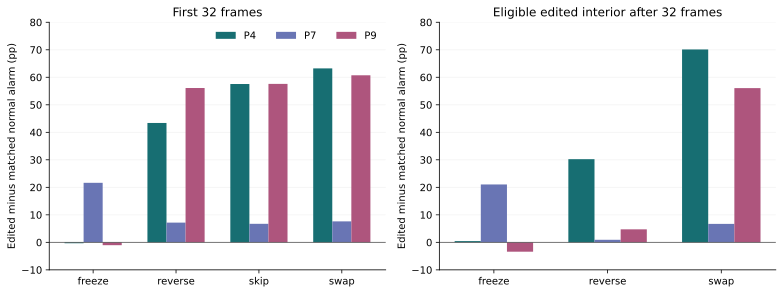

역행·구간 교환은 유효 내부에서도 P4의 편집–원본 경보율 차이가 남았습니다. 정지는 P4의 내부 반응도 정상 원본과 비슷하여, 실패를 편집 시작점만의 문제로 설명하기 어렵습니다. 내부 평가에는 짧은 편집이 제외되므로 처음 32프레임과 다른 조건부 표본이며 창 길이도 다릅니다. **내부 구간에도 경계에서 바뀐 추적 상태가 남으므로 편집 흔적과 독립적인 순서 이해를 입증한 결과는 아닙니다.** Skip에는 지속 내부 구간이 없습니다.

원본 영상 동일 가중 → severity 동일 가중 → 적격 scene 동일 가중으로 집계했습니다. 이 분석은 점추정이며 신규 학습은 없습니다. 세 seed와 stride 1의 coverage·수치는 [상세 결과](results/E14/summary.json)에 있습니다. 새로운 변화량 대응 대조군과 편집 후 회복 실험은 E14 후속 항목으로 남깁니다.

미완료 후속 항목: E7 실제 위치·유형 주석, E13 시간 모델·정지 보완, E15 보정 개선, 새로운 E14 대응 편집·회복 검증, 개선 후 최종 E11, 외부 baseline, E10 독립 촬영, end-to-end 온라인 지연. 이 단계의 historical/합성 결과는 탐색적 근거이며 이 항목들을 대신하지 않습니다.

## 보정과 경보 결합 E15B0·E15B/C

[사전 설계](docs/PAPER_NEXT_EXPERIMENTS_20261009.md) · [고정 설정](configs/experiments/followup/e15bc_v1.json) · [코드 검사](results/paper_calibration_tests.txt)

### E15B0 경보 손실·보정 해상도 진단 완료

고정 E11B 점수로 60개 단위를 검사했습니다. 아래는 seed 42, α=1%입니다. ORfree는 C/P 각자의 q99 임계값을 유지하는 진단이며 전체 1% 예산 방법이 아닙니다.

| 정책 | 실제 이벤트 / 66 | C 대비 추가 | C 대비 손실 | 정상 OOF grid FAR % |
| --- | --- | --- | --- | --- |
| C | 33 | 0 | 0 | 9.65 |
| MAX | 29 | 3 | 7 | 9.87 |
| ORfree | 36 | 3 | 0 | 13.57 |

| 장면 | C / CP / ORfree 탐지 | C grid FAR % | ORfree grid FAR % | P만 추가한 정상 창 % |
| --- | --- | --- | --- | --- |
| R01 | 8 / 8 / 8 | 9.24 | 10.50 | 1.26 |
| R02 | 4 / 5 / 5 | 2.08 | 7.56 | 5.48 |
| R03 | 7 / 4 / 8 | 15.26 | 20.94 | 5.68 |
| R04 | 14 / 12 / 15 | 12.00 | 15.27 | 3.28 |

원 임계값 OR는 C의 탐지를 보존하지만 추가 정상 경보를 발생시킵니다. 60개 단위 중 **37개**에서 C/P/CP 모두 q95=q99.5입니다. 임계값 보정 영상은 3–4개, 겹치는 창은 21–33개이므로 높은 분위수의 구분 능력이 제한됩니다. 창 수를 독립 표본 수로 해석하지 않습니다. 원본 하나 제외 임계값과 ECDF jump도 각 run에 공개했습니다.

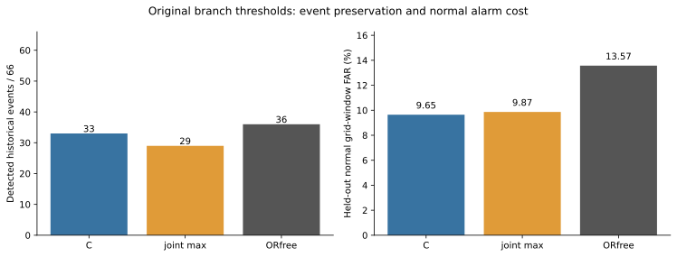

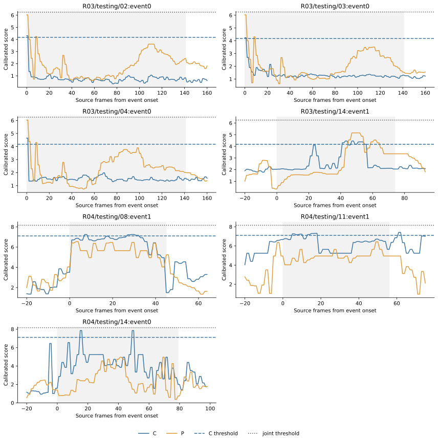

회색 영역은 이벤트 onset부터 탐지 deadline까지입니다. 패널별 점수 범위는 다릅니다.

[원본 수치](results/E15B0/summary.json) · [재현 검증](results/E15B0/validation.txt)

### E15B/C 정상 보정·결합 정책 비교 완료

R01–R04×5-fold×3-seed의 60개 단위, 고정 편집 3,910개를 seed별로 재생하여 총 11,730회 평가했습니다. seed 반복을 독립 편집 표본으로 세지 않습니다. G0는 기존 보정, G1은 reference 영상별 동일 가중 보정입니다. 모델·raw score·tail 외삽은 고정했습니다. 8개 주 조건과 ORfree 진단 2개를 각각 α=1%,5%,10%에서 평가했습니다. 아래는 seed 42, 명목 α=1%입니다. **동일 명목 예산은 동일 실제 FAR을 뜻하지 않습니다.**

| 보정 | 정책 | 실제 이벤트 / 66 | 동일 G의 C 대비 추가 / 손실 | 정상 grid FAR % | 합성 event % | Matched FAR % |
| --- | --- | --- | --- | --- | --- | --- |
| G0 | C | 33 | 0 / 0 | 9.65 | 33.78 | 7.75 |
| G0 | MAX | 29 | 3 / 7 | 9.87 | 56.72 | 10.63 |
| G0 | OR75 | 36 | 3 / 0 | 13.57 | 61.04 | 15.04 |
| G0 | OR50 | 36 | 3 / 0 | 13.57 | 61.04 | 15.04 |
| G0 | ORfree | 36 | 3 / 0 | 13.57 | 61.04 | 15.04 |
| G1 | C | 33 | 0 / 0 | 9.75 | 33.85 | 7.75 |
| G1 | MAX | 29 | 3 / 7 | 10.50 | 57.01 | 11.42 |
| G1 | OR75 | 36 | 3 / 0 | 13.78 | 61.04 | 15.04 |
| G1 | OR50 | 36 | 3 / 0 | 13.78 | 61.04 | 15.04 |
| G1 | ORfree | 36 | 3 / 0 | 13.78 | 61.04 | 15.04 |

**주 운영점에서 OR75=OR50=ORfree가 모든 60개 실행, 두 보정 방식에서 동일했습니다.** 높은 분위수가 같은 관측값에 걸렸기 때문입니다. 75:25나 50:50 예산 배분의 우수성을 보여준 결과가 아닙니다. OR는 3개 실제 이벤트를 추가하고 손실 7개를 복구하지만, C 대비 정상 grid FAR 증가를 동반합니다.

| 보정 | α=1% | α=5% | α=10% |
| --- | --- | --- | --- |
| G0 | 60/60 | 37/60 | 3/60 |
| G1 | 60/60 | 37/60 | 3/60 |

위 표는 OR75·OR50·ORfree의 **임계값 쌍이 모두 같은 실행 수**입니다. 중첩 창을 독립 표본으로 세지 않습니다.

| 비교 | 실제 event recall Δ pp [95% CI] | Grid FAR Δ pp [95% CI] | 합성 event Δ pp [95% CI] |
| --- | --- | --- | --- |
| G0/MAX − G0/C | -4.67 [-12.11, +3.77] | +0.22 [-1.80, +2.30] | +22.94 [+20.23, +25.66] |
| G0/OR75 − G0/C | +4.10 [+0.00, +10.00] | +3.92 [+2.31, +5.72] | +27.25 [+24.93, +29.61] |
| G1/MAX − G1/C | -4.67 [-12.11, +3.77] | +0.75 [-1.16, +2.70] | +23.17 [+20.53, +25.76] |
| G1/OR75 − G1/C | +4.10 [+0.00, +10.00] | +4.03 [+2.42, +5.81] | +27.19 [+24.92, +29.53] |

CI는 seed 42 고정 모델에 조건부인 원본 영상 paired bootstrap 2,000회입니다. 실제 recall은 장면별 비율의 macro이며 66개 이벤트를 합친 micro와 다릅니다. 양성 이벤트가 없는 bootstrap 표본 1개는 macro recall이 정의되지 않아 제외되어 유효 1,999회입니다. FAR와 합성 지표는 유효 2,000회입니다. 유지·추가·손실의 비율 CI, 모든 장면 제외 분석도 공개했습니다.

| Seed | G0 C / MAX / OR75 이벤트 | G1 C / MAX / OR75 이벤트 | G0 OR75 grid FAR % | G1 OR75 grid FAR % |
| --- | --- | --- | --- | --- |
| 42 | 33 / 29 / 36 | 33 / 29 / 36 | 13.57 | 13.78 |
| 43 | 32 / 29 / 35 | 32 / 29 / 35 | 13.57 | 13.78 |
| 44 | 32 / 29 / 35 | 32 / 29 / 35 | 13.70 | 13.90 |

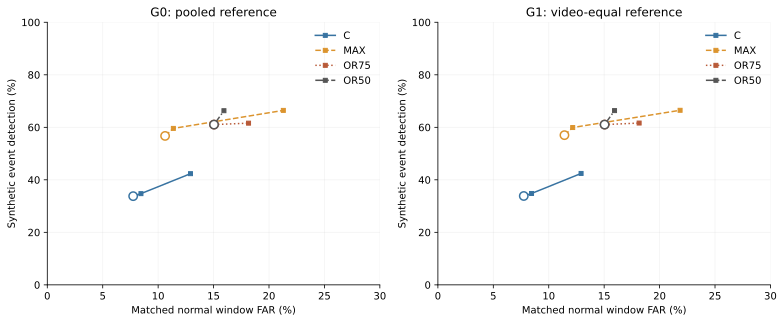

원은 α=1%, 나머지 두 점은 사전 지정한 5%,10%입니다. 선은 세 운영점을 연결한 것이며 연속 ROC나 평가 정상 라벨로 FAR을 일치시킨 곡선이 아닙니다. 중복 점은 겹쳐 보입니다.

G1은 G0 대비 실사 AP 변화가 매우 작았습니다. Seed 42에서 C 72.42→72.45%, MAX 73.43→73.45%였습니다. 이는 통계적 우월성 주장이 아니며, 실제 탐지 이벤트 수는 같고 정상 grid FAR은 감소하지 않았습니다. OR 정책에는 인위적인 순위 점수를 부여하지 않았습니다.

| 장면 | G0 C 정상 frame FPR % | G1 C 정상 frame FPR % | G0 MAX 정상 frame FPR % | G1 MAX 정상 frame FPR % |
| --- | --- | --- | --- | --- |
| R01 | 56.40 | 56.40 | 45.87 | 45.87 |
| R02 | 0.04 | 0.04 | 0.63 | 0.63 |
| R03 | 3.76 | 3.76 | 2.09 | 2.70 |
| R04 | 1.57 | 1.57 | 0.89 | 0.89 |

이 표는 **historical 라벨 0 프레임**에서 각 정책의 자체 window 임계값을 적용한 결과입니다. OOF grid FAR 및 E15A의 Full 공통 임계값 component 초과율과 다릅니다. R01은 G1에서도 개선되지 않았습니다. 보정 reference의 영상 길이 편향만으로 분포 차이를 설명할 수 없습니다. 실제 원인 판정에는 원본·라벨 검토가 필요합니다.

판정: **정상 오경보를 통제하면서 C의 탐지를 보존하고 P의 이득을 추가한다는 목표는 미달성입니다.** 이번 비교에서 주 방법을 교체하지 않습니다. 낮은 FAR의 세밀한 예산 탐색은 중단하고 독립 정상 보정 자료, R01 검토와 E7B 실제 단계 주석을 우선합니다. P의 합성 시간 교란 탐지 효과와 실제 경보의 비용을 구분해 논문에 제시합니다.

[전체 운영점·장면별 수치](results/E15BC/seed42/summary.json) · [원본 paired CI](results/E15BC/seed42/bootstrap.json) · [전체 검증](results/E15BC/validation.txt) · [실행 기록](results/paper_calibration_execution.json)

로컬 RTX PRO 6000에서 생성된 고정 CUDA 특징을 재사용했습니다. 이번 통계 재생은 CPU에서 수행했고, 60개 단위 실행 시간 합계는 223.9초입니다. 이는 특징 추출·집계·검증 시간을 제외하므로 end-to-end 실시간 성능이 아닙니다. 독립 인간 주석과 신규 촬영, 외부 baseline은 미완료입니다.

R01 원본 검토용으로 점수·모델 출력·선정 이유를 숨긴 로컬 문맥 구간 43개를 준비했습니다(균등 23, 점수 기반 탐색 20). 두 묶음은 발생률 추정에 합치지 않습니다. **독립 인간 검토 완료는 0개**이며, 이 자료로 원인을 확정하지 않았습니다. [검토 안내](docs/R01_AUDIT_GUIDE.md) · [준비 상태](results/E15BC/r01_audit_packet.json).

## 최소 구성과 오경보 진단 E11B·E15A

[후속 설계](docs/PAPER_STAGE2_DESIGN.md) · [고정 실행 설정](configs/experiments/followup/e11b_e15a_v1.json) · [코드 검사](results/paper_diagnostics_tests.txt)

### E11B 최소 구성 비교 완료

E11의 고정 checkpoint와 원래 여섯 분기를 유지하고 CP=max(C,P)를 추가했습니다. R01–R04×5-fold×3-seed 60개 단위, 합성 11,730개 편집을 재계산했습니다. 새 CP 임계값은 정상 threshold 영상에서만 구했습니다. 아래는 seed 42입니다.

| 구성 | Historical AP % | AUROC % | 합성 event % | Matched 정상 FAR % | Grid 정상 FAR % |
| --- | --- | --- | --- | --- | --- |
| A | 68.00 | 76.26 | 7.88 | 6.86 | 7.86 |
| C | 72.42 | 79.40 | 33.78 | 7.75 | 9.65 |
| P | 62.43 | 69.48 | 57.43 | 10.88 | 7.26 |
| A+C | 71.10 | 77.81 | 25.85 | 7.53 | 9.26 |
| A+P | 70.56 | 78.47 | 50.24 | 9.78 | 8.88 |
| C+P | 73.43 | 79.90 | 56.72 | 10.63 | 9.87 |
| Full | 73.11 | 79.59 | 51.61 | 9.78 | 9.56 |

AP는 historical 프레임 순위 성능이며, 합성 event는 기존 D=0.2T deadline의 탐지율입니다. T는 FIT recording 길이 척도입니다. 동일 q99 보정이 동일 실제 FAR을 보장하지 않습니다. 기존 데이터에서의 탐색적 비교이며 독립 검증이 아닙니다.

| 비교 | AP 차이 pp [95% CI] | R02 제외 AP 차이 pp [95% CI] | 합성 event 차이 pp [95% CI] |
| --- | --- | --- | --- |
| CP-C | +1.01 [-1.81, +4.68] | -2.21 [-4.73, +0.04] | +22.94 [+20.24, +25.60] |
| B3-CP | -0.33 [-1.14, +0.06] | -0.38 [-0.65, -0.04] | -5.12 [-7.57, -3.05] |
| B3-C | +0.68 [-2.00, +3.84] | -2.59 [-5.16, -0.33] | +17.82 [+14.24, +21.33] |

CP−C와 Full−CP가 사전 주 비교이고 Full−C는 보조 비교입니다. CI는 seed 42 고정 모델의 원본 영상 paired bootstrap 2,000회입니다. 네 가지 장면 제외 분석은 민감도 분석이며 미관측 장면 일반화가 아닙니다.

| 장면 | C AP % | CP AP % | Full AP % | C 이벤트 | CP 이벤트 | Full 이벤트 | CP의 C 대비 추가/손실 | Full의 CP 대비 추가/손실 |
| --- | --- | --- | --- | --- | --- | --- | --- | --- |
| R01 | 75.63 | 74.51 | 73.83 | 8/8 | 8/8 | 8/8 | 0/0 | 0/0 |
| R02 | 73.91 | 84.59 | 84.42 | 4/15 | 5/15 | 5/15 | 1/0 | 0/0 |
| R03 | 56.30 | 51.56 | 51.07 | 7/17 | 4/17 | 4/17 | 1/4 | 0/0 |
| R04 | 83.85 | 83.07 | 83.12 | 14/26 | 12/26 | 12/26 | 1/3 | 0/0 |

이벤트 수는 연속 양성 구간이며 실제 이상 유형은 아직 미주석입니다. 서로 다른 정상 임계값 때문에 CP도 C의 경보를 잃을 수 있습니다. 새 임계값의 합성 지연·경보 프레임 수는 기존 지연 요약에서 추정하지 않고 재생성한 전체 W-window 점수로 계산했습니다.

| Seed | C AP % | CP AP % | Full AP % | CP 합성 event % | CP matched FAR % |
| --- | --- | --- | --- | --- | --- |
| 42 | 72.42 | 73.43 | 73.11 | 56.72 | 10.63 |
| 43 | 72.41 | 73.31 | 73.54 | 55.78 | 11.02 |
| 44 | 72.56 | 73.58 | 73.24 | 55.67 | 10.63 |

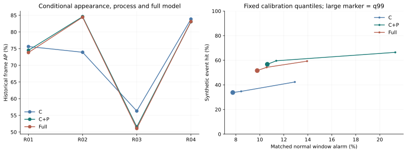

Seed 42에서 C는 33/66개, CP와 Full은 각각 29/66개 이벤트를 탐지했습니다. CP는 C 대비 3개를 추가하고 7개를 잃었으며, Full은 CP 대비 이벤트 추가·손실이 없었습니다. CP−C의 평균 AP 개선 CI는 0을 포함하고 R02를 제외한 점추정은 음수입니다. 따라서 진행 신호의 광범위한 상보성을 확정할 수 없습니다. A의 추가 필요성도 현 결과로 강하게 지지되지 않지만, Full−CP의 전체 장면 AP CI가 0을 포함하므로 CP의 통계적 우월성을 확정하지 않습니다.

[검증 로그](results/E11B/validation.txt) · [Historical 결과와 장면 제외 분석](results/E11B/seed42/historical_summary.json) · [paired CI](results/E11B/seed42/historical_bootstrap.json) · [합성 운영 곡선](results/E11B/seed42/synthetic_summary.json) · [합성 추가·손실과 경보 지속 비율](results/E11B/seed42/synthetic_overlap.json)

### E15A 고정 모델 오경보 진단 완료

같은 60개 단위에서 8개 raw/component 점수를 다시 계산했습니다. 아래는 seed 42이며, 정상 OOF는 5개 fold에서 원본마다 한 번, historical은 fold 0 모델의 라벨 0 프레임입니다. **보정이나 임계값을 개선한 실험은 아직 아닙니다.**

| 장면 | OOF 영상 | OOF 정상 frame FPR % | Historical 정상 포함 영상 | Historical 정상 frame FPR % | 경보 중 A winner % | C winner % | P winner % |
| --- | --- | --- | --- | --- | --- | --- | --- |
| R01 | 34 | 5.46 | 15 | 45.87 | 18.83 | 79.37 | 1.79 |
| R02 | 30 | 0.56 | 12 | 0.00 | — | — | — |
| R03 | 22 | 2.53 | 13 | 2.21 | 6.54 | 66.01 | 27.45 |
| R04 | 25 | 0.63 | 19 | 0.89 | 0.00 | 0.00 | 100.00 |

Winner는 경보 프레임에서 가장 큰 분기 점수의 비율이며 동률은 균등 배분했습니다. 경보가 없는 R02의 조건부 winner는 정의되지 않습니다. 이는 상관된 분기 사이의 인과적 책임 또는 해당 분기를 제거한 효과가 아닙니다. 실제 제거 효과는 E11B로 확인합니다. Component의 자체 q99 초과율과 Full의 공통 임계값 초과율도 별도로 공개합니다.

R01 historical 정상 프레임에서 A outside와 C outside의 Full 임계값 초과율은 각각 45.29%, 45.62%입니다. P가 winner인 비율은 해당 정상 경보의 1.79%입니다. 따라서 P만 제거하거나 정지 탐지만 추가하는 것으로 R01의 문제를 해결했다고 볼 수 없습니다. 분포 차이는 확인되었지만 물리적 원인은 원본 영상 검토가 필요합니다.

| 장면 | 정상 구간 | 영상 수 | 정상 프레임 | Full frame FPR % |
| --- | --- | --- | --- | --- |
| R01 | 첫 양성 이전/양성 없음 | 15 | 1957 | 32.75 |
| R01 | 첫 양성 이후 정상 | 8 | 474 | 100.00 |
| R02 | 첫 양성 이전/양성 없음 | 12 | 2580 | 0.00 |
| R02 | 첫 양성 이후 정상 | 8 | 2514 | 0.00 |
| R03 | 첫 양성 이전/양성 없음 | 13 | 5494 | 2.71 |
| R03 | 첫 양성 이후 정상 | 5 | 1443 | 0.28 |
| R04 | 첫 양성 이전/양성 없음 | 19 | 2100 | 0.10 |
| R04 | 첫 양성 이후 정상 | 8 | 1476 | 2.03 |

이 구분은 관측된 binary 라벨에 따른 진단입니다. 원인을 조명·배경이나 tracker 잔류로 확정하지 않습니다. 미확인 라벨 구간은 정상으로 바꾸지 않았고, 동일 영상이 두 정상 구간에 포함될 수 있습니다.

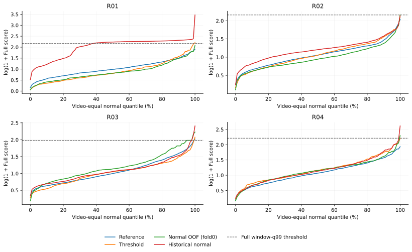

곡선은 fold 0에서 각 원본 영상의 가중치를 같게 둔 Full 정상 점수의 분위수입니다. 정상 window-q99 임계값과 프레임 점수 분포는 다른 통계량입니다. Historical 정상 프레임의 높은 값이 사건 이전에도 나타나는지 함께 확인해야 합니다.

| 장면 | 초기32 FPR % | 이후 FPR % | phase0 | phase1 | phase2 | phase3 |
| --- | --- | --- | --- | --- | --- | --- |
| R01 | 3.12 | 5.83 | 4.02 | 6.79 | 6.04 | 4.90 |
| R02 | 6.25 | 0.24 | 1.60 | 0.00 | 0.51 | 0.29 |
| R03 | 1.14 | 2.60 | 0.25 | 2.95 | 3.51 | 3.59 |
| R04 | 0.00 | 0.68 | 0.12 | 0.00 | 1.20 | 1.19 |

Phase는 모델의 추정 좌표이며 실제 단계 정답이 아닙니다. 빈 bin은 실패 0%로 대체하지 않습니다. 초기/phase별 차이도 서로 다른 조건부 표본에 대한 기술 통계입니다.

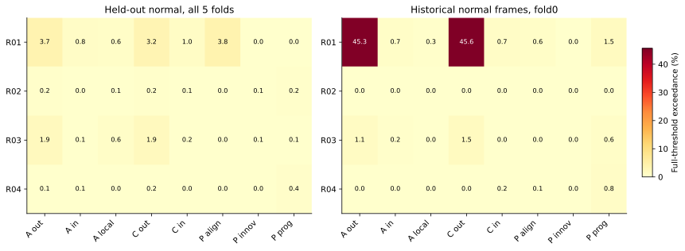

이 그림의 각 칸은 해당 component가 Full 임계값을 넘은 정상 프레임 비율입니다. 여러 component가 동시에 넘을 수 있어 합계는 Full FPR과 같지 않습니다. Exclusive exceedance와 tied winner를 원 수치에 따로 기록했습니다.

[검증 로그](results/E15A/validation.txt) · [원본별 집계와 전체 strata](results/E15A/summary.json) · [raw/calibrated 분위수](results/E15A/distributions.json)

로컬 RTX PRO 6000의 고정 CUDA 특징을 재사용했고 통계 점수 재계산은 CPU에서 수행했습니다. 이 단계에는 학습·보정 변경이 없습니다. E15B/C의 후속 결과는 [최신 보정 실험](docs/PAPER_CALIBRATION_RESULTS.md)을 참고하세요. E13B, E14B, E12B, E7B 독립 주석, 외부 baseline, end-to-end streaming 및 독립 촬영 검증은 미완료입니다.

## 실험 상태

| 단계 | 내용 | 상태 |
| --- | --- | --- |
| E0 | 환경·데이터·테스트 | completed |
| E1 | R02 재현 | completed |
| E2 | R01–R04 확장 | completed |
| E3 | 핵심 2×2 ablation | completed |
| E4 | 세부 제거·이산 phase 대조 | completed |
| E5 | 3 seeds·stride·사례 분석 | completed |


## 방법과 평가 규칙

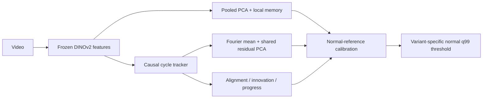

- DINOv2-base / 336px letterbox / layer -1,-3 / 6×6 patches / FP16 / primary stride 2.
- Fit, validation, reference, threshold 영상을 분리합니다. 테스트 라벨로 설정·임계값을 고르지 않습니다.
- 실제 cycle 경계가 없는 `weak_recording_alignment`입니다. Cycle 위치 정확도는 미측정입니다.
- 원본 recording group 정보가 없어 파일 간 그룹 독립성은 입증하지 못했습니다.
- 주지표: frame AUROC/AP. 표의 값은 %이며, `AUROC / AP` 순서입니다. Macro는 네 장면의 단순 평균입니다.
- FPR/Recall/Event coverage는 정상 holdout q99 임계값 기준입니다. 지연은 탐지된 이벤트에 한정한 원본 프레임 수입니다.

[구현 방법](docs/METHOD.md) · [전체 사전 실험 규칙](docs/EXPERIMENT_PROTOCOL.md) · [환경 및 패키지 버전](results/E0/environment.json) · [고정 데이터 분할](results/E0/splits.json)

## E0 — 데이터와 재현 기반

| 장면 | 학습 영상 | 학습 프레임 | 테스트 영상 | 테스트 프레임 | 유효 평가 | 제외 프레임 |
| --- | --- | --- | --- | --- | --- | --- |
| R01 | 34 | 7808 | 15 | 3685 | 3685 | 0 |
| R02 | 30 | 17756 | 15 | 9618 | 7706 | 1912 |
| R03 | 22 | 15346 | 17 | 12005 | 12005 | 0 |
| R04 | 25 | 9732 | 19 | 8154 | 8154 | 0 |


R02 테스트 12/13/14의 라벨 길이가 각각 1프레임씩 다릅니다. 원본을 수정하지 않고 세 영상 전체 1,912프레임을 평가에서 제외합니다. 모든 모델에 같은 `strict-v1` 마스크를 적용하며, 전체 공식 benchmark와 동일한 평가라고 주장하지 않습니다.

[검사 결과](results/E0/data_audit.json) · [테스트 로그](results/E0/test_output.txt)

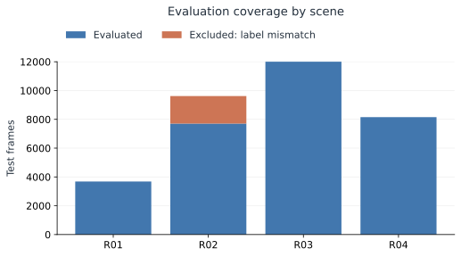

## E1 — R02 로컬 재실행

| 분기 | 기존 노트북 AUROC/AP | 로컬 AUROC/AP | ΔAUROC (pp) |
| --- | --- | --- | --- |
| appearance | 79.6916 / 72.6953 | 79.7203 / 72.7276 | +0.0287 |
| cycle_conditioned | 79.6962 / 72.7088 | 79.7256 / 72.7415 | +0.0294 |
| combined | 91.6316 / 87.4450 | 91.6305 / 87.4478 | -0.0011 |


기존 값은 노트북에 표시된 반올림 수치입니다. Colab의 전체 패키지 버전·원본 캐시가 없어 비트 단위 재현을 주장하지 않습니다. [실행 결과](results/E1/R02/metrics.json)

## E2 — R01–R04 확장

| 모델 | R01 | R02 | R03 | R04 | Macro |
| --- | --- | --- | --- | --- | --- |
| Pooled PCA | 83.77 / 62.79 | 79.78 / 72.85 | 63.11 / 52.74 | 77.48 / 80.23 | 76.04 / 67.15 |
| Appearance (A0) | 83.77 / 62.79 | 79.72 / 72.73 | 63.11 / 52.68 | 77.57 / 80.09 | 76.05 / 67.07 |
| Cycle-conditioned (A1) | 83.77 / 62.79 | 79.73 / 72.74 | 63.11 / 52.68 | 77.56 / 80.09 | 76.04 / 67.07 |
| Full (A3) | 83.49 / 61.60 | 91.63 / 87.45 | 63.78 / 53.41 | 74.35 / 76.71 | 78.31 / 69.79 |


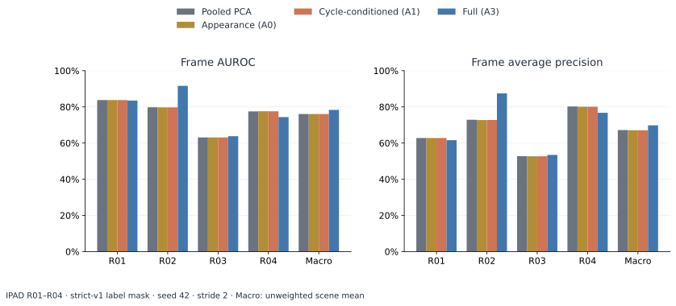

| 장면 | Full FPR | Full Recall | 이벤트 탐지/전체 | 탐지 이벤트 지연 중앙값 |
| --- | --- | --- | --- | --- |
| R01 | 64.25 | 100.00 | 8/8 | 0.0 |
| R02 | 1.06 | 48.55 | 8/15 | 8.5 |
| R03 | 7.34 | 12.27 | 10/17 | 193.0 |
| R04 | 3.08 | 14.33 | 14/26 | 38.0 |


## E3 — 핵심 요소 2×2 ablation

| 모델 | R01 | R02 | R03 | R04 | Macro |
| --- | --- | --- | --- | --- | --- |
| Appearance (A0) | 83.77 / 62.79 | 79.72 / 72.73 | 63.11 / 52.68 | 77.57 / 80.09 | 76.05 / 67.07 |
| Cycle-conditioned (A1) | 83.77 / 62.79 | 79.73 / 72.74 | 63.11 / 52.68 | 77.56 / 80.09 | 76.04 / 67.07 |
| Appearance + process (A2) | 83.49 / 61.60 | 91.63 / 87.45 | 63.78 / 53.41 | 74.35 / 76.71 | 78.31 / 69.79 |
| Full (A3) | 83.49 / 61.60 | 91.63 / 87.45 | 63.78 / 53.41 | 74.35 / 76.71 | 78.31 / 69.79 |


A0: 외형, A1: 외형+조건부 외형, A2: 외형+진행, A3: 모두 결합. 같은 특징·분할·추적기를 사용하며 A2는 E2의 동결된 예측을 재사용합니다.

| 효과 (Macro pp) | AUROC | AP |
| --- | --- | --- |
| 조건부 외형 추가: A1−A0 | -0.001 | +0.003 |
| 진행 추가: A2−A0 | +2.269 | +2.720 |
| 진행 위에 조건부 외형 추가: A3−A2 | -0.000 | -0.000 |


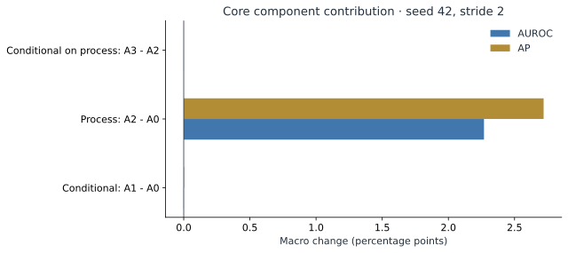

## E4 — 세부 ablation

| 모델 | R01 | R02 | R03 | R04 | Macro |
| --- | --- | --- | --- | --- | --- |
| Full (A3) | 83.49 / 61.60 | 91.63 / 87.45 | 63.78 / 53.41 | 74.35 / 76.71 | 78.31 / 69.79 |
| no_alignment | 83.49 / 61.60 | 91.81 / 87.84 | 63.72 / 53.38 | 74.69 / 76.97 | 78.43 / 69.95 |
| no_innovation | 83.49 / 61.60 | 90.76 / 87.11 | 63.58 / 53.30 | 72.97 / 75.86 | 77.70 / 69.47 |
| no_progress | 83.77 / 62.79 | 83.76 / 78.19 | 63.45 / 52.90 | 78.08 / 80.32 | 77.27 / 68.55 |
| single_lag | 83.61 / 62.24 | 87.14 / 81.47 | 63.37 / 53.02 | 74.48 / 77.61 | 77.15 / 68.59 |
| no_confidence | 87.65 / 71.69 | 91.81 / 87.72 | 63.51 / 53.51 | 74.62 / 76.86 | 79.40 / 72.45 |
| no_local | 83.49 / 61.60 | 91.69 / 87.56 | 63.78 / 53.47 | 73.84 / 76.25 | 78.20 / 69.72 |
| no_pooled | 71.79 / 51.30 | 90.94 / 82.96 | 60.23 / 52.52 | 71.69 / 74.97 | 73.66 / 65.44 |
| outside_only | 83.69 / 62.46 | 91.70 / 87.66 | 63.79 / 53.44 | 74.65 / 76.87 | 78.46 / 70.11 |
| discrete_phase | 83.49 / 61.60 | 91.62 / 87.43 | 63.85 / 53.43 | 74.35 / 76.71 | 78.33 / 69.79 |


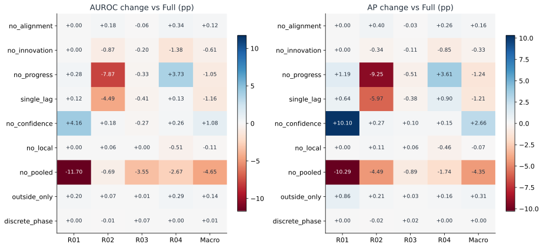

양수는 해당 변형이 Full보다 높다는 뜻입니다. `no_local`은 local-memory 점수만 제거하며 지역 descriptor는 유지합니다. 이산 phase는 자체 구현한 4-bin 대조군입니다.

| 장면 | 이산 phase 실제 rank | 연속 조건부 bytes | 이산 조건부 bytes |
| --- | --- | --- | --- |
| R01 | [16, 16, 16, 16] | 1007872 | 835840 |
| R02 | [16, 16, 16, 16] | 1007872 | 835840 |
| R03 | [16, 16, 16, 16] | 1007872 | 835840 |
| R04 | [16, 16, 16, 16] | 1007872 | 835840 |


### 분기 활성화 진단

| 장면 | 평균 confidence | 조건부 점수가 외형을 초과 (%) | 진행 점수가 A1을 초과 (%) |
| --- | --- | --- | --- |
| R01 | 0.085 | 0.00 | 5.77 |
| R02 | 0.727 | 5.99 | 41.77 |
| R03 | 0.562 | 0.00 | 8.57 |
| R04 | 0.155 | 0.15 | 58.84 |


각 테스트 영상의 sampled-frame 평균을 구한 뒤 영상 간 단순 평균했습니다. 라벨 불일치 영상도 이 라벨 비의존 진단에는 포함합니다. Confidence는 위치 정확도의 확률이 아닙니다.

## E5 — 안정성·stride·사례 분석

| 모델 | Macro AUROC 평균 ± SD | Macro AP 평균 ± SD |
| --- | --- | --- |
| Pooled PCA | 75.90 ± 0.12 | 66.98 ± 0.15 |
| Appearance (A0) | 75.69 ± 0.31 | 66.70 ± 0.33 |
| Cycle-conditioned (A1) | 75.69 ± 0.31 | 66.70 ± 0.33 |
| Appearance + process (A2) | 78.09 ± 0.19 | 69.62 ± 0.16 |
| Full (A3) | 78.09 ± 0.19 | 69.62 ± 0.16 |


Seed 42/43/44의 모델 무작위성만 변경했습니다. 정상 데이터 분할과 encoder projection은 고정입니다. 표준편차는 신뢰구간이 아니며 데이터 분할 불확실성은 포함하지 않습니다.

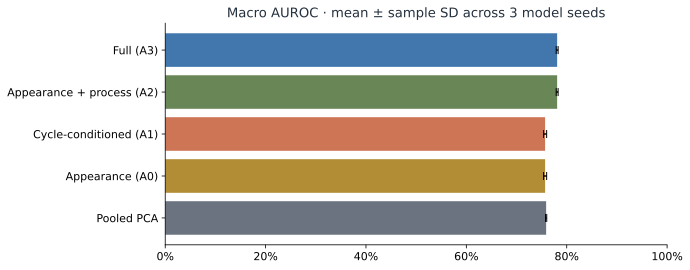

| 모델 | Stride 2 Macro AUROC/AP | Stride 1 Macro AUROC/AP |
| --- | --- | --- |
| Pooled PCA | 76.04 / 67.15 | 76.11 / 67.51 |
| Full (A3) | 78.31 / 69.79 | 76.83 / 68.44 |


Stride 1은 descriptor 차분과 진행 점수의 **샘플 단위 lag를 그대로 유지**하므로 실제 원본 프레임 기준 시간 범위도 줄어듭니다. 순수한 샘플링 밀도 효과만 분리한 실험은 아닙니다.

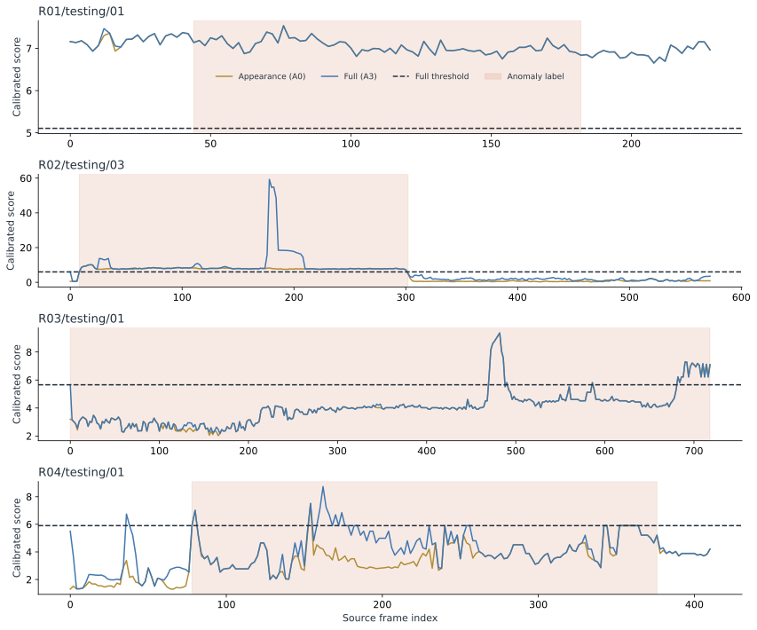

각 장면에서 이름순으로 처음 나타나는 유효 이상 영상을 표시했습니다. 성능이 좋은 사례를 골라내지 않았습니다. 각 패널은 장면별 보정 점수와 독립적인 y축 범위를 사용하므로 점수 크기를 장면 간 직접 비교하지 않습니다.

### 오류 사례 점검

| 장면 | 선정 기준 | 영상 | FPR | Recall | 탐지 이벤트 |
| --- | --- | --- | --- | --- | --- |
| R01 | highest FPR | R01/testing/01 | 100.00 | 100.00 | 1/1 |
| R01 | lowest recall | R01/testing/01 | 100.00 | 100.00 | 1/1 |
| R02 | highest FPR | R02/testing/15 | 4.34 | 0.00 | 0/2 |
| R02 | lowest recall | R02/testing/08 | 0.34 | 0.00 | 0/4 |
| R03 | highest FPR | R03/testing/17 | 40.81 | — | 0/0 |
| R03 | lowest recall | R03/testing/08 | 1.38 | 0.00 | 0/1 |
| R04 | highest FPR | R04/testing/08 | 13.24 | 10.43 | 1/3 |
| R04 | lowest recall | R04/testing/02 | 3.57 | 0.00 | 0/1 |


각 장면에서 Full의 FPR 최대 영상과 Recall 최소 이상 영상을 진단 목적으로 선정했습니다. 대표 표본이 아니며 이상 유형의 원인을 자동 확정하지 않습니다.

## 실행 비용

| 단계 | 실측 wall time (초) |
| --- | --- |
| E0 | 4.0 |
| E1 | 96.2 |
| E2 | 191.4 |
| E3 | 0.0 |
| E4 | 24.9 |
| E5 | 566.5 |


E0 시간은 테스트 실행만 포함합니다. E1 이후 시간은 해당 단계의 특징 추출·학습·공유 점수 계산을 포함하며 업로드/환경 설치 시간은 제외합니다. 개별 ablation의 독립 추론 latency로 해석하지 않습니다.

E5 PyTorch allocator peak: allocated 0.615 GiB, reserved 0.701 GiB. 드라이버와 다른 프로세스 메모리는 포함하지 않습니다.

## 재현

```bash
python3 -m venv .venv
.venv/bin/pip install torch==2.9.1 torchvision==0.24.1 --index-url https://download.pytorch.org/whl/cu128
.venv/bin/pip install -r requirements-local.txt
export PYTHONPATH=src
export HF_HOME="$PWD/.cache/huggingface"
export MPLCONFIGDIR="$PWD/.cache/matplotlib"
export OMP_NUM_THREADS=4 OPENBLAS_NUM_THREADS=4
.venv/bin/python scripts/audit.py --data-root /path/to/IPAD_dataset
.venv/bin/python -m pytest -q
# E1 → E2 → E3 → E4 → E5 순서로 실행
.venv/bin/python scripts/run_stage.py --stage E1 --config configs/experiments/replay_pinned.json --data-root /path/to/IPAD_dataset
.venv/bin/python scripts/report.py
```

사전학습 checkpoint revision은 [고정 재현 설정](configs/experiments/replay_pinned.json)에 기록했습니다. 실제 실행 환경은 [lock 파일](results/E0/requirements-lock.txt)을 참고하세요. E0 완료 표시는 검사·테스트 통과 후 기록합니다. 원본 프레임, 특징 캐시, 모델 체크포인트는 Git에 포함하지 않습니다. 각 단계의 JSON/CSV, 설정, 코드 fingerprint와 그래프를 공개합니다. [최종 22개 테스트](results/final_tests.txt)와 [결과 정합성 검사](results/final_validation.txt)도 확인할 수 있습니다.

## 한계

실제 cycle 경계, 원본 recording 그룹, pixel localization GT가 없는 상태입니다. R02 라벨 불일치 영상은 제외했고 알려진 이상 유형별 주석이 없어 정지/역행/생략별 실데이터 탐지 성능을 별도로 주장하지 않습니다. 테스트 비교 결과로 최적 모델을 자동 선택하지 않습니다.
