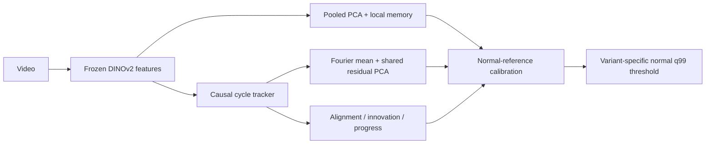

# CycleVAD — IPAD R01–R04 experiments

공정의 연속 진행 위치를 추적해 조건부 외형 이상과 진행 흐름의 이상을 결합하는 subspace AD 실험입니다.

로컬 **NVIDIA RTX PRO 6000 Blackwell Max-Q 96GB**에서 특징을 추출하고 CPU에서 통계 모델을 학습합니다. 수치는 실제 결과 JSON에서 자동 생성합니다.

## 실험 상태

| 단계 | 내용 | 상태 |
| --- | --- | --- |
| E0 | 환경·데이터·테스트 | completed |
| E1 | R02 재현 | completed |
| E2 | R01–R04 확장 | pending |
| E3 | 핵심 2×2 ablation | pending |
| E4 | 세부 제거·이산 phase 대조 | pending |
| E5 | 3 seeds·stride·사례 분석 | pending |


## 방법과 평가 규칙



- DINOv2-base / 336px letterbox / layer -1,-3 / 6×6 patches / FP16 / primary stride 2.
- Fit, validation, reference, threshold 영상을 분리합니다. 테스트 라벨로 설정·임계값을 고르지 않습니다.
- 실제 cycle 경계가 없는 `weak_recording_alignment`입니다. Cycle 위치 정확도는 미측정입니다.
- 원본 recording group 정보가 없어 파일 간 그룹 독립성은 입증하지 못했습니다.
- 주지표: frame AUROC/AP. 표의 값은 %이며, `AUROC / AP` 순서입니다. Macro는 네 장면의 단순 평균입니다.
- FPR/Recall/Event coverage는 정상 holdout q99 임계값 기준입니다. 지연은 탐지된 이벤트에 한정한 원본 프레임 수입니다.

[전체 사전 실험 규칙](docs/EXPERIMENT_PROTOCOL.md) · [환경 및 패키지 버전](results/E0/environment.json) · [고정 데이터 분할](results/E0/splits.json)

## E0 — 데이터와 재현 기반

| 장면 | 학습 영상 | 학습 프레임 | 테스트 영상 | 테스트 프레임 | 유효 평가 | 제외 프레임 |
| --- | --- | --- | --- | --- | --- | --- |
| R01 | 34 | 7808 | 15 | 3685 | 3685 | 0 |
| R02 | 30 | 17756 | 15 | 9618 | 7706 | 1912 |
| R03 | 22 | 15346 | 17 | 12005 | 12005 | 0 |
| R04 | 25 | 9732 | 19 | 8154 | 8154 | 0 |


R02 테스트 12/13/14의 라벨 길이가 각각 1프레임씩 다릅니다. 원본을 수정하지 않고 세 영상 전체 1,912프레임을 평가에서 제외합니다. 모든 모델에 같은 `strict-v1` 마스크를 적용하며, 전체 공식 benchmark와 동일한 평가라고 주장하지 않습니다.

[검사 결과](results/E0/data_audit.json) · [테스트 로그](results/E0/test_output.txt)


## E1 — R02 로컬 재실행

| 분기 | 기존 노트북 AUROC/AP | 로컬 AUROC/AP | ΔAUROC (pp) |
| --- | --- | --- | --- |
| appearance | 79.6916 / 72.6953 | 79.7203 / 72.7276 | +0.0287 |
| cycle_conditioned | 79.6962 / 72.7088 | 79.7256 / 72.7415 | +0.0294 |
| combined | 91.6316 / 87.4450 | 91.6305 / 87.4478 | -0.0011 |


기존 값은 노트북에 표시된 반올림 수치입니다. Colab의 전체 패키지 버전·원본 캐시가 없어 비트 단위 재현을 주장하지 않습니다. [실행 결과](results/E1/R02/metrics.json)

## 실행 비용

| 단계 | 실측 wall time (초) |
| --- | --- |
| E0 | 4.0 |
| E1 | 96.2 |


E0 시간은 테스트 실행만 포함합니다. E1 이후 시간은 해당 단계의 특징 추출·학습·공유 점수 계산을 포함하며 업로드/환경 설치 시간은 제외합니다. 개별 ablation의 독립 추론 latency로 해석하지 않습니다.

## 재현

```bash
python3 -m venv .venv
.venv/bin/pip install torch==2.9.1 torchvision==0.24.1 --index-url https://download.pytorch.org/whl/cu128
.venv/bin/pip install -r requirements-local.txt
export PYTHONPATH=src
export HF_HOME="$PWD/.cache/huggingface"
export MPLCONFIGDIR="$PWD/.cache/matplotlib"
export OMP_NUM_THREADS=4 OPENBLAS_NUM_THREADS=4
.venv/bin/python scripts/audit.py --data-root /path/to/IPAD_dataset
.venv/bin/python -m pytest -q
# E1 → E2 → E3 → E4 → E5 순서로 실행
.venv/bin/python scripts/run_stage.py --stage E1 --data-root /path/to/IPAD_dataset
.venv/bin/python scripts/report.py
```

실제 실행 환경은 [lock 파일](results/E0/requirements-lock.txt)을 참고하세요. E0 완료 표시는 검사·테스트 통과 후 기록합니다. 원본 프레임, 특징 캐시, 모델 체크포인트는 Git에 포함하지 않습니다. 각 단계의 JSON/CSV, 설정, 코드 fingerprint와 그래프를 공개합니다.

## 한계

실제 cycle 경계, 원본 recording 그룹, pixel localization GT가 없는 상태입니다. R02 라벨 불일치 영상은 제외했고 알려진 이상 유형별 주석이 없어 정지/역행/생략별 실데이터 탐지 성능을 별도로 주장하지 않습니다. 테스트 비교 결과로 최적 모델을 자동 선택하지 않습니다.
