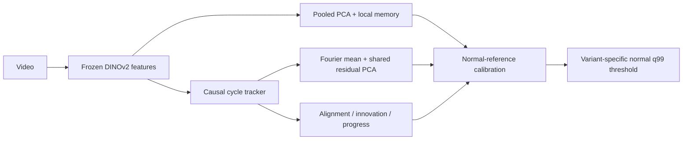

# CycleVAD — IPAD R01–R04 experiments

공정의 연속 진행 위치를 추적해 조건부 외형 이상과 진행 흐름의 이상을 결합하는 subspace AD 실험입니다.

로컬 **NVIDIA RTX PRO 6000 Blackwell Max-Q 96GB**에서 특징을 추출하고 CPU에서 통계 모델을 학습합니다. 수치는 실제 결과 JSON에서 자동 생성합니다.

## 주요 관찰

- Seed 42, stride 2의 Full Macro AUROC는 **78.31%**, Appearance는 **76.05%**입니다.
- 진행 점수의 추가 효과(A2−A0)는 Macro AUROC **+2.269 pp**입니다. 조건부 외형의 추가 효과는 현재 설정에서 거의 없습니다.
- Confidence 가중치를 제거하면 Full 대비 Macro AUROC가 **+1.082 pp** 변합니다. 이는 신뢰도 가중 방식의 재검토 근거이며, 테스트 결과로 최적 모델을 확정한 것은 아닙니다.
- R01 Full의 정상 프레임 오경보율은 **64.25%**입니다. 정상 holdout q99 임계값이 테스트 정상 프레임에 잘 일반화되지 않아, 높은 Recall을 단독으로 해석하면 안 됩니다.
- R02에서 나타난 큰 향상이 R01·R04에서는 재현되지 않습니다. 장면별 결과와 음의 효과도 함께 공개합니다.

## 후속 실험 계획 — 아직 미실행

[구체적인 E6–E10 실험 명세](docs/FOLLOWUP_EXPERIMENTS.md): 위치 추적 대조군 3개, Confidence 학습·추론 3×3 조합, 진행 이상 대조군 6개를 정의했습니다. 정상 5-fold 분할과 40개 영상의 주석 대상 목록을 고정했으며, 실제 주석과 후속 실험 결과는 아직 없습니다.

## 실험 상태

| 단계 | 내용 | 상태 |
| --- | --- | --- |
| E0 | 환경·데이터·테스트 | completed |
| E1 | R02 재현 | completed |
| E2 | R01–R04 확장 | completed |
| E3 | 핵심 2×2 ablation | completed |
| E4 | 세부 제거·이산 phase 대조 | completed |
| E5 | 3 seeds·stride·사례 분석 | completed |


## 방법과 평가 규칙



- DINOv2-base / 336px letterbox / layer -1,-3 / 6×6 patches / FP16 / primary stride 2.
- Fit, validation, reference, threshold 영상을 분리합니다. 테스트 라벨로 설정·임계값을 고르지 않습니다.
- 실제 cycle 경계가 없는 `weak_recording_alignment`입니다. Cycle 위치 정확도는 미측정입니다.
- 원본 recording group 정보가 없어 파일 간 그룹 독립성은 입증하지 못했습니다.
- 주지표: frame AUROC/AP. 표의 값은 %이며, `AUROC / AP` 순서입니다. Macro는 네 장면의 단순 평균입니다.
- FPR/Recall/Event coverage는 정상 holdout q99 임계값 기준입니다. 지연은 탐지된 이벤트에 한정한 원본 프레임 수입니다.

[구현 방법](docs/METHOD.md) · [전체 사전 실험 규칙](docs/EXPERIMENT_PROTOCOL.md) · [환경 및 패키지 버전](results/E0/environment.json) · [고정 데이터 분할](results/E0/splits.json)

## E0 — 데이터와 재현 기반

| 장면 | 학습 영상 | 학습 프레임 | 테스트 영상 | 테스트 프레임 | 유효 평가 | 제외 프레임 |
| --- | --- | --- | --- | --- | --- | --- |
| R01 | 34 | 7808 | 15 | 3685 | 3685 | 0 |
| R02 | 30 | 17756 | 15 | 9618 | 7706 | 1912 |
| R03 | 22 | 15346 | 17 | 12005 | 12005 | 0 |
| R04 | 25 | 9732 | 19 | 8154 | 8154 | 0 |


R02 테스트 12/13/14의 라벨 길이가 각각 1프레임씩 다릅니다. 원본을 수정하지 않고 세 영상 전체 1,912프레임을 평가에서 제외합니다. 모든 모델에 같은 `strict-v1` 마스크를 적용하며, 전체 공식 benchmark와 동일한 평가라고 주장하지 않습니다.

[검사 결과](results/E0/data_audit.json) · [테스트 로그](results/E0/test_output.txt)


## E1 — R02 로컬 재실행

| 분기 | 기존 노트북 AUROC/AP | 로컬 AUROC/AP | ΔAUROC (pp) |
| --- | --- | --- | --- |
| appearance | 79.6916 / 72.6953 | 79.7203 / 72.7276 | +0.0287 |
| cycle_conditioned | 79.6962 / 72.7088 | 79.7256 / 72.7415 | +0.0294 |
| combined | 91.6316 / 87.4450 | 91.6305 / 87.4478 | -0.0011 |


기존 값은 노트북에 표시된 반올림 수치입니다. Colab의 전체 패키지 버전·원본 캐시가 없어 비트 단위 재현을 주장하지 않습니다. [실행 결과](results/E1/R02/metrics.json)

## E2 — R01–R04 확장

| 모델 | R01 | R02 | R03 | R04 | Macro |
| --- | --- | --- | --- | --- | --- |
| Pooled PCA | 83.77 / 62.79 | 79.78 / 72.85 | 63.11 / 52.74 | 77.48 / 80.23 | 76.04 / 67.15 |
| Appearance (A0) | 83.77 / 62.79 | 79.72 / 72.73 | 63.11 / 52.68 | 77.57 / 80.09 | 76.05 / 67.07 |
| Cycle-conditioned (A1) | 83.77 / 62.79 | 79.73 / 72.74 | 63.11 / 52.68 | 77.56 / 80.09 | 76.04 / 67.07 |
| Full (A3) | 83.49 / 61.60 | 91.63 / 87.45 | 63.78 / 53.41 | 74.35 / 76.71 | 78.31 / 69.79 |


| 장면 | Full FPR | Full Recall | 이벤트 탐지/전체 | 탐지 이벤트 지연 중앙값 |
| --- | --- | --- | --- | --- |
| R01 | 64.25 | 100.00 | 8/8 | 0.0 |
| R02 | 1.06 | 48.55 | 8/15 | 8.5 |
| R03 | 7.34 | 12.27 | 10/17 | 193.0 |
| R04 | 3.08 | 14.33 | 14/26 | 38.0 |


## E3 — 핵심 요소 2×2 ablation

| 모델 | R01 | R02 | R03 | R04 | Macro |
| --- | --- | --- | --- | --- | --- |
| Appearance (A0) | 83.77 / 62.79 | 79.72 / 72.73 | 63.11 / 52.68 | 77.57 / 80.09 | 76.05 / 67.07 |
| Cycle-conditioned (A1) | 83.77 / 62.79 | 79.73 / 72.74 | 63.11 / 52.68 | 77.56 / 80.09 | 76.04 / 67.07 |
| Appearance + process (A2) | 83.49 / 61.60 | 91.63 / 87.45 | 63.78 / 53.41 | 74.35 / 76.71 | 78.31 / 69.79 |
| Full (A3) | 83.49 / 61.60 | 91.63 / 87.45 | 63.78 / 53.41 | 74.35 / 76.71 | 78.31 / 69.79 |


A0: 외형, A1: 외형+조건부 외형, A2: 외형+진행, A3: 모두 결합. 같은 특징·분할·추적기를 사용하며 A2는 E2의 동결된 예측을 재사용합니다.

| 효과 (Macro pp) | AUROC | AP |
| --- | --- | --- |
| 조건부 외형 추가: A1−A0 | -0.001 | +0.003 |
| 진행 추가: A2−A0 | +2.269 | +2.720 |
| 진행 위에 조건부 외형 추가: A3−A2 | -0.000 | -0.000 |


## E4 — 세부 ablation

| 모델 | R01 | R02 | R03 | R04 | Macro |
| --- | --- | --- | --- | --- | --- |
| Full (A3) | 83.49 / 61.60 | 91.63 / 87.45 | 63.78 / 53.41 | 74.35 / 76.71 | 78.31 / 69.79 |
| no_alignment | 83.49 / 61.60 | 91.81 / 87.84 | 63.72 / 53.38 | 74.69 / 76.97 | 78.43 / 69.95 |
| no_innovation | 83.49 / 61.60 | 90.76 / 87.11 | 63.58 / 53.30 | 72.97 / 75.86 | 77.70 / 69.47 |
| no_progress | 83.77 / 62.79 | 83.76 / 78.19 | 63.45 / 52.90 | 78.08 / 80.32 | 77.27 / 68.55 |
| single_lag | 83.61 / 62.24 | 87.14 / 81.47 | 63.37 / 53.02 | 74.48 / 77.61 | 77.15 / 68.59 |
| no_confidence | 87.65 / 71.69 | 91.81 / 87.72 | 63.51 / 53.51 | 74.62 / 76.86 | 79.40 / 72.45 |
| no_local | 83.49 / 61.60 | 91.69 / 87.56 | 63.78 / 53.47 | 73.84 / 76.25 | 78.20 / 69.72 |
| no_pooled | 71.79 / 51.30 | 90.94 / 82.96 | 60.23 / 52.52 | 71.69 / 74.97 | 73.66 / 65.44 |
| outside_only | 83.69 / 62.46 | 91.70 / 87.66 | 63.79 / 53.44 | 74.65 / 76.87 | 78.46 / 70.11 |
| discrete_phase | 83.49 / 61.60 | 91.62 / 87.43 | 63.85 / 53.43 | 74.35 / 76.71 | 78.33 / 69.79 |


양수는 해당 변형이 Full보다 높다는 뜻입니다. `no_local`은 local-memory 점수만 제거하며 지역 descriptor는 유지합니다. 이산 phase는 자체 구현한 4-bin 대조군입니다.

| 장면 | 이산 phase 실제 rank | 연속 조건부 bytes | 이산 조건부 bytes |
| --- | --- | --- | --- |
| R01 | [16, 16, 16, 16] | 1007872 | 835840 |
| R02 | [16, 16, 16, 16] | 1007872 | 835840 |
| R03 | [16, 16, 16, 16] | 1007872 | 835840 |
| R04 | [16, 16, 16, 16] | 1007872 | 835840 |


### 분기 활성화 진단

| 장면 | 평균 confidence | 조건부 점수가 외형을 초과 (%) | 진행 점수가 A1을 초과 (%) |
| --- | --- | --- | --- |
| R01 | 0.085 | 0.00 | 5.77 |
| R02 | 0.727 | 5.99 | 41.77 |
| R03 | 0.562 | 0.00 | 8.57 |
| R04 | 0.155 | 0.15 | 58.84 |


각 테스트 영상의 sampled-frame 평균을 구한 뒤 영상 간 단순 평균했습니다. 라벨 불일치 영상도 이 라벨 비의존 진단에는 포함합니다. Confidence는 위치 정확도의 확률이 아닙니다.

## E5 — 안정성·stride·사례 분석

| 모델 | Macro AUROC 평균 ± SD | Macro AP 평균 ± SD |
| --- | --- | --- |
| Pooled PCA | 75.90 ± 0.12 | 66.98 ± 0.15 |
| Appearance (A0) | 75.69 ± 0.31 | 66.70 ± 0.33 |
| Cycle-conditioned (A1) | 75.69 ± 0.31 | 66.70 ± 0.33 |
| Appearance + process (A2) | 78.09 ± 0.19 | 69.62 ± 0.16 |
| Full (A3) | 78.09 ± 0.19 | 69.62 ± 0.16 |


Seed 42/43/44의 모델 무작위성만 변경했습니다. 정상 데이터 분할과 encoder projection은 고정입니다. 표준편차는 신뢰구간이 아니며 데이터 분할 불확실성은 포함하지 않습니다.


| 모델 | Stride 2 Macro AUROC/AP | Stride 1 Macro AUROC/AP |
| --- | --- | --- |
| Pooled PCA | 76.04 / 67.15 | 76.11 / 67.51 |
| Full (A3) | 78.31 / 69.79 | 76.83 / 68.44 |


Stride 1은 descriptor 차분과 진행 점수의 **샘플 단위 lag를 그대로 유지**하므로 실제 원본 프레임 기준 시간 범위도 줄어듭니다. 순수한 샘플링 밀도 효과만 분리한 실험은 아닙니다.


각 장면에서 이름순으로 처음 나타나는 유효 이상 영상을 표시했습니다. 성능이 좋은 사례를 골라내지 않았습니다. 각 패널은 장면별 보정 점수와 독립적인 y축 범위를 사용하므로 점수 크기를 장면 간 직접 비교하지 않습니다.

### 오류 사례 점검

| 장면 | 선정 기준 | 영상 | FPR | Recall | 탐지 이벤트 |
| --- | --- | --- | --- | --- | --- |
| R01 | highest FPR | R01/testing/01 | 100.00 | 100.00 | 1/1 |
| R01 | lowest recall | R01/testing/01 | 100.00 | 100.00 | 1/1 |
| R02 | highest FPR | R02/testing/15 | 4.34 | 0.00 | 0/2 |
| R02 | lowest recall | R02/testing/08 | 0.34 | 0.00 | 0/4 |
| R03 | highest FPR | R03/testing/17 | 40.81 | — | 0/0 |
| R03 | lowest recall | R03/testing/08 | 1.38 | 0.00 | 0/1 |
| R04 | highest FPR | R04/testing/08 | 13.24 | 10.43 | 1/3 |
| R04 | lowest recall | R04/testing/02 | 3.57 | 0.00 | 0/1 |


각 장면에서 Full의 FPR 최대 영상과 Recall 최소 이상 영상을 진단 목적으로 선정했습니다. 대표 표본이 아니며 이상 유형의 원인을 자동 확정하지 않습니다.

## 실행 비용

| 단계 | 실측 wall time (초) |
| --- | --- |
| E0 | 4.0 |
| E1 | 96.2 |
| E2 | 191.4 |
| E3 | 0.0 |
| E4 | 24.9 |
| E5 | 566.5 |


E0 시간은 테스트 실행만 포함합니다. E1 이후 시간은 해당 단계의 특징 추출·학습·공유 점수 계산을 포함하며 업로드/환경 설치 시간은 제외합니다. 개별 ablation의 독립 추론 latency로 해석하지 않습니다.

E5 PyTorch allocator peak: allocated 0.615 GiB, reserved 0.701 GiB. 드라이버와 다른 프로세스 메모리는 포함하지 않습니다.

## 재현

```bash
python3 -m venv .venv
.venv/bin/pip install torch==2.9.1 torchvision==0.24.1 --index-url https://download.pytorch.org/whl/cu128
.venv/bin/pip install -r requirements-local.txt
export PYTHONPATH=src
export HF_HOME="$PWD/.cache/huggingface"
export MPLCONFIGDIR="$PWD/.cache/matplotlib"
export OMP_NUM_THREADS=4 OPENBLAS_NUM_THREADS=4
.venv/bin/python scripts/audit.py --data-root /path/to/IPAD_dataset
.venv/bin/python -m pytest -q
# E1 → E2 → E3 → E4 → E5 순서로 실행
.venv/bin/python scripts/run_stage.py --stage E1 --config configs/experiments/replay_pinned.json --data-root /path/to/IPAD_dataset
.venv/bin/python scripts/report.py
```

사전학습 checkpoint revision은 [고정 재현 설정](configs/experiments/replay_pinned.json)에 기록했습니다. 실제 실행 환경은 [lock 파일](results/E0/requirements-lock.txt)을 참고하세요. E0 완료 표시는 검사·테스트 통과 후 기록합니다. 원본 프레임, 특징 캐시, 모델 체크포인트는 Git에 포함하지 않습니다. 각 단계의 JSON/CSV, 설정, 코드 fingerprint와 그래프를 공개합니다. [최종 22개 테스트](results/final_tests.txt)와 [결과 정합성 검사](results/final_validation.txt)도 확인할 수 있습니다.

## 한계

실제 cycle 경계, 원본 recording 그룹, pixel localization GT가 없는 상태입니다. R02 라벨 불일치 영상은 제외했고 알려진 이상 유형별 주석이 없어 정지/역행/생략별 실데이터 탐지 성능을 별도로 주장하지 않습니다. 테스트 비교 결과로 최적 모델을 자동 선택하지 않습니다.
