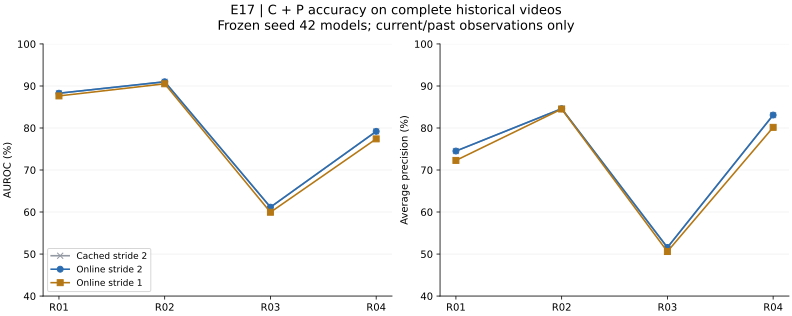

## 온라인 탐지 정확도 — E17 완료

AUROC는 온라인 이상 점수의 **탐지 정확도**를 평가하고, FPS·지연은 처리 속도를 평가합니다. 각 점수는 현재·과거 관측만으로 생성하며, AUROC/AP 계산에 정답을 사후 사용하는 것은 미래 프레임 참조가 아닙니다.

**R01–R04 전체 테스트 66개 영상·33,462프레임**을 JPEG부터 batch 1로 순차 처리했습니다. strict-v1에서 라벨 길이가 맞지 않는 R02의 3개 영상·1,912프레임은 처리하되 지표에서는 제외했습니다. 평가 분모는 63개 영상·31,550프레임입니다. Seed 42/fold 0의 E11 모델·보정값·E11B 임계값을 고정했으며 재학습·테스트 라벨 기반 튜닝은 없습니다.

Stride 1은 매 프레임 새 점수를 생성하고, stride 2는 짝수 프레임에서만 갱신하며 홀수 프레임에 직전 점수를 유지합니다. **두 경우 모두 전체 유효 프레임에서 평가**했습니다. Stride 1은 기존 stride 2 모델에 시간 간격과 source-frame lag만 맞춘 실험이며 별도 cadence 보정은 하지 않았습니다.

| 모델 | 기존 캐시 S2 AUROC / AP % | 온라인 S2 AUROC / AP % | 온라인 S1 AUROC / AP % |
| --- | --- | --- | --- |
| A | 76.26 / 68.00 | 76.26 / 67.99 | 76.38 / 68.09 |
| C | 79.40 / 72.42 | 79.40 / 72.43 | 78.94 / 71.67 |
| P | 69.48 / 62.43 | 69.47 / 62.43 | 68.62 / 61.70 |
| CP | 79.90 / 73.43 | 79.91 / 73.44 | 78.88 / 71.89 |
| Full | 79.59 / 73.11 | 79.60 / 73.11 | 78.55 / 71.51 |

표는 장면별 pooled-frame 지표를 계산한 뒤 네 장면을 동일 가중한 Macro 평균입니다. 기존 캐시 결과도 인과적 추정이며, 온라인 S2와의 차이는 실행 경로·특징 추출 배치 등의 수치 차이를 포함합니다. 캐시 특징은 온라인 추론에 사용하지 않았습니다.

| 장면 | 온라인 S1 C AUROC / AP % | 온라인 S1 C+P AUROC / AP % | 온라인 S2 C+P AUROC / AP % |
| --- | --- | --- | --- |
| R01 | 88.18 / 74.00 | 87.63 / 72.28 | 88.28 / 74.51 |
| R02 | 79.48 / 73.32 | 90.52 / 84.51 | 91.00 / 84.59 |
| R03 | 67.23 / 55.75 | 59.95 / 50.59 | 61.16 / 51.56 |
| R04 | 80.85 / 83.62 | 77.41 / 80.15 | 79.20 / 83.08 |



| C+P 비교 | Macro AUROC 변화 pp [95% CI] | Macro AP 변화 pp [95% CI] |
| --- | --- | --- |
| stride1_minus_stride2 | -1.030 [-1.939, -0.337] | -1.553 [-2.968, -0.498] |
| stride2_minus_cached | +0.006 [+0.000, +0.013] | +0.006 [-0.010, +0.024] |

CI는 장면별 source-file paired bootstrap 2,000회입니다. 재학습 불확실성과 원본 recording 간 종속성은 반영하지 않습니다. 같은 개발 테스트를 재사용하므로 독립 데이터에서의 일반화 검증은 아닙니다.

현재 고정 모델에서 온라인 stride 2는 기존 결과를 거의 재현했습니다. 반면 stride 1 전환 시 C+P의 Macro AUROC는 -1.03 pp, AP는 -1.55 pp 변했습니다. 판별 빈도를 높였다고 정확도가 개선되는 것은 아닙니다. 논문에서 기존 stride 2 결과와 매 프레임 stride 1 결과를 구분해야 하며, 이 비교로 재학습한 stride 1 모델의 성능까지 판단할 수는 없습니다.

**경보 성능은 AUROC와 다릅니다.** 고정된 정상 window-q99 임계값에서 C+P의 historical 정상 프레임 FPR / 이상 프레임 Recall Macro 평균은 stride2: 12.37% / 36.43%, stride1: 12.91% / 37.01%입니다. 높은 AUROC가 낮은 오경보나 충분한 경보 Recall을 보장하지 않으며, E15의 보정 문제는 별도 과제로 남습니다.

E16의 별도 속도 측정에서 C+P stride 1은 **87.36 FPS**, 새 점수 지연 p95는 **12.77 ms**였습니다. E17은 전체 영상 정확도 평가이며, 현재 프레임의 encoder 출력만 두 개의 독립 추적 상태에 공유했습니다. E17 실행 시간은 두 설정 동시 평가와 검증을 포함하므로 단일 파이프라인 FPS로 사용하지 않습니다. E16의 카메라·영상 코덱·전송 지연 제외 조건도 유지됩니다.

모든 영상·두 cadence에서 새로 추출한 동일 특징에 대한 배치 참조와 온라인 tracker/C/P 점수 일치를 확인했습니다. 영상 사이에서만 상태를 초기화하며, 영상 내부에서 이상 라벨에 따라 초기화하지 않습니다. 홀수 프레임 hold 일치, 전체 프레임 수·unknown 제외, 기존 E11B 지표 재현도 검사했습니다.

[실험 명세](../configs/experiments/followup/online_accuracy_v1.json) · [전체 지표·CI·검증](../results/E17/summary.json) · [실행 환경](../results/E17/environment.json) · [검사 로그](../results/E17/validation.txt) · [재현 코드](../scripts/evaluate_streaming.py)

재현: 기존 E11/E11B seed 42 checkpoint와 IPAD 원본 JPEG가 있는 환경에서 실행합니다. 모델 경로와 encoder revision은 위 명세에 고정되어 있습니다.

```bash
PYTHONPATH=src python scripts/evaluate_streaming.py --resume
MPLCONFIGDIR=/tmp/cyclevad-mpl PYTHONPATH=src python scripts/report_online_accuracy.py
```

