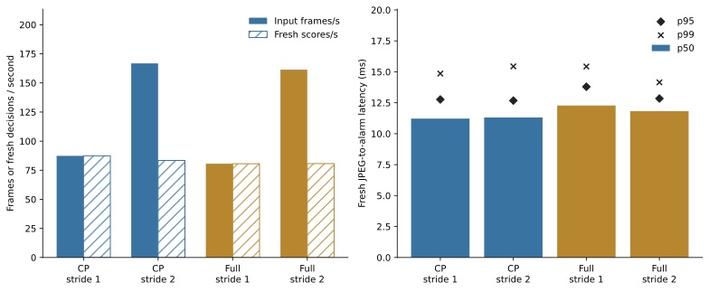

## 실제 입력 스트리밍 성능 E16

[실행 설정](../configs/experiments/followup/streaming_v1.json) · [전체 수치](../results/E16/summary.json) · [검증](../results/E16/validation.txt) · [테스트](../results/streaming_tests.txt)

로컬 **NVIDIA RTX PRO 6000 Blackwell Max-Q Workstation Edition**, 고정 DINOv2-base 336×336, FP16 AMP, batch 1로 데이터셋 JPEG(입력 256×256)를 매번 다시 읽었습니다. JPEG 읽기·디코딩→전처리→GPU 전송→특징 추출→CPU 추적·C/P 또는 Full→임계값 판정을 포함합니다. 미래 이미지 prefetch, 특징 캐시, 동적 batch, torch.compile은 사용하지 않았습니다. 모델은 seed 42/fold 0 고정이며 CPU는 AMD Ryzen 5 5600X 6-Core Processor이며 연산은 4 threads입니다.

정상 evaluation 2개와 historical 2개씩 총 16개 영상에서 각각 처음 128프레임을 재생했습니다. 설정당 2,048 입력 프레임×3회, 전체 24,576 입력 프레임을 측정했습니다. 별도 FIT 영상 100프레임으로 warmup했고 녹화 전환마다 상태를 초기화했습니다. 파일·프레임 목록은 설정에 공개했습니다.

| 구성 | Stride | 입력 처리 FPS | 새 점수 / 초 | 새 판정 p50 ms | p95 ms | p99 ms | 입력 FPS 3회 범위 |
| --- | --- | --- | --- | --- | --- | --- | --- |
| CP | 1 | 87.36 | 87.36 | 11.22 | 12.77 | 14.86 | 84.84–89.51 |
| CP | 2 | 166.80 | 83.40 | 11.31 | 12.68 | 15.44 | 161.43–173.70 |
| Full | 1 | 80.59 | 80.59 | 12.28 | 13.79 | 15.43 | 79.15–81.80 |
| Full | 2 | 161.42 | 80.71 | 11.82 | 12.84 | 14.15 | 158.46–163.39 |

FPS는 총 프레임 수÷반복 실행 총 wall time입니다. 지연 분위수는 새 점수를 계산한 프레임만 모았습니다. Stride 2의 중간 프레임은 실제 JPEG를 읽되 특징 추출 없이 직전 판정을 유지하므로, 입력 FPS를 매 프레임 새 추론 FPS로 해석하면 안 됩니다. 단일 스트림이며 여러 카메라의 총 처리량이 아닙니다.

**Stride 2가 기존 평가 설정입니다. Stride 1은 같은 가중치에서 source-time 전이 간격과 과거 lag를 1프레임 간격으로 맞춘 속도 실험입니다. E16에서는 Stride 1 정확도를 미평가했으며, 후속 E17에서 전체 영상의 온라인 AUROC/AP를 평가했습니다. 임계값 재보정은 하지 않았습니다.** 저장된 D-window-q99 임계값은 정상 보정에 사용한 통계량이며, 실행 시 미래 D프레임을 모아 기다리는 창이 아닙니다. 현재 프레임 점수가 임계값을 넘으면 즉시 출력합니다.

| 구성 | Stride | decode/reset ms | 전처리 ms | H2D ms | GPU 특징 ms | D2H ms | 추적·점수 ms |
| --- | --- | --- | --- | --- | --- | --- | --- |
| CP | 1 | 0.47 | 3.08 | 0.17 | 6.44 | 0.06 | 1.17 |
| CP | 2 | 0.40 | 3.12 | 0.18 | 6.49 | 0.07 | 1.20 |
| Full | 1 | 0.47 | 3.17 | 0.18 | 6.47 | 0.07 | 2.01 |
| Full | 2 | 0.38 | 3.03 | 0.16 | 6.40 | 0.06 | 1.86 |

단계 값은 새 관측 프레임의 평균입니다. CUDA를 구간마다 동기화하여 GPU 비동기 호출 시간을 처리 시간으로 오인하지 않았습니다. 구간 계측과 Python 호출의 작은 잔여 비용 때문에 단계 합과 전체 지연은 완전히 같지 않을 수 있습니다.

| 장면 | C+P stride 1 FPS | p95 ms | C+P stride 2 입력 FPS | p95 ms |
| --- | --- | --- | --- | --- |
| R01 | 90.11 | 12.00 | 166.75 | 13.14 |
| R02 | 87.14 | 12.51 | 165.61 | 12.51 |
| R03 | 87.34 | 12.70 | 166.01 | 12.90 |
| R04 | 85.02 | 13.35 | 168.97 | 12.26 |

### 설정한 30/60 FPS 도착 시각 재생

장면당 별도 128프레임, 총 512프레임씩 CP 경로를 재생했습니다. 프레임 i의 도착 예정 시각은 시작+i/목표 FPS이고, 도착 전에는 이미지를 읽지 않습니다. 늦으면 FIFO 순서로 처리하며 프레임을 버리지 않습니다. 영상마다 시계와 상태를 초기화했습니다. 실제 카메라의 원본 FPS를 추정한 결과가 아닙니다.

| Stride | 목표 FPS | 새 판정 도착→완료 p50 ms | p95 ms | p99 ms | 최대 추가 대기 프레임 | 한 프레임 주기 초과 % |
| --- | --- | --- | --- | --- | --- | --- |
| 1 | 30 | 13.41 | 15.88 | 17.65 | 0 | 0.00 |
| 1 | 60 | 11.35 | 12.15 | 12.76 | 0 | 0.00 |
| 2 | 30 | 13.56 | 16.71 | 17.58 | 0 | 0.00 |
| 2 | 60 | 13.77 | 15.92 | 16.79 | 0 | 0.59 |

추가 대기 프레임은 각 처리 시작 시 현재 처리할 프레임을 제외한 대기 수입니다. 현재 프레임 자체의 대기 시간은 도착→완료 지연에 포함됩니다. 한 프레임 주기 초과율은 held 판정까지 포함한 전체 입력 기준입니다. Stride 2에서는 신규 점수 간격이 입력 주기의 2배이며, 새 이상이 건너뛴 프레임에 시작하면 다음 관측까지 최대 한 입력 주기의 추가 지연이 생길 수 있습니다. 한 번의 짧은 재생 결과가 장시간 카메라 운영을 보장하지는 않습니다.

모델 로딩 1.70초, warmup 전 첫 JPEG→판정 421.24ms였습니다. steady-state 표에서는 이 초기 비용을 제외했습니다. PyTorch peak GPU allocated는 최대 383.0 MiB, reserved는 406.0 MiB입니다. process-lifetime peak RSS는 1601.8 MiB이며, GPU 전체 장치 점유나 런별 증가량이 아닙니다.

인과성 검증: 추적기는 누적 posterior와 최대 32 source-frame의 lag buffer를 유지하며 현재까지의 관측만 사용합니다. 같은 prefix 뒤의 미래 입력을 바꾼 단위 검사가 통과했고, 실제 새로 추출한 특징 768개에서 CP 순차 실행과 기존 인과적 reference의 위치·C/P·경보가 일치했습니다. 3회 반복에서도 점수와 경보가 일치했습니다.

측정 범위의 한계: IPAD는 현재 로컬 JPEG frame sequence이므로 H.264/H.265 디코딩, 실제 카메라/네트워크 수신, 화면 렌더링·알림 전송은 포함하지 않습니다. OS 파일 캐시는 비우지 않았습니다. 이 실험은 정확도 개선이나 R01 오경보 해결의 근거가 아닙니다.

